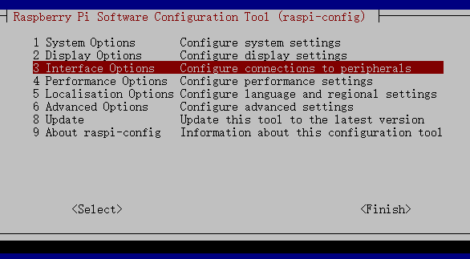
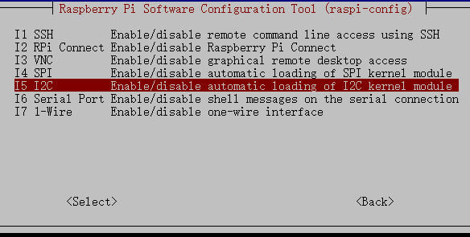

.. _i2c_config:

I2C Configuration
-----------------------

Follow the steps below to enable and test the I²C interface on your Raspberry Pi.  
These instructions work for Raspberry Pi 5, 4, 3, and Zero 2W.

-----------------------

**Step 1: Enable the I²C interface**

Open the Raspberry Pi configuration tool:

.. raw:: html

   <run></run>

.. code-block::

    sudo raspi-config

In the menu, navigate to:

**3 Interface Options → I2C**

Select **I2C** to enable it.

Choose **<Yes>** when asked to enable the I²C interface.

.. image:: img/i2c_yes.png
    :align: center

When finished, select **<Ok> → <Finish>**.  
If prompted, reboot your Raspberry Pi.

-----------------------

**Step 2: Check whether the I²C kernel modules are loaded**

Run:

.. raw:: html

   <run></run>

.. code-block::

    lsmod | grep i2c

If I²C is enabled, you will see output similar to:

.. code-block::

    i2c_dev                     6276    0
    i2c_bcm2708                 4121    0

If nothing appears, reboot your Raspberry Pi:

.. code-block::

    sudo reboot

-----------------------

**Step 3: Install i2c-tools**

This package provides commands for detecting I²C devices.

.. raw:: html

   <run></run>

.. code-block::

    sudo apt install i2c-tools

-----------------------

**Step 4: Detect connected I²C devices**

For Raspberry Pi 2 and later (Pi 3, Pi 4, Pi 5, Zero 2W):

.. raw:: html

    <run></run>

.. code-block::

    i2cdetect -y 1

For Raspberry Pi 1:

.. raw:: html

   <run></run>

.. code-block::

    i2cdetect -y 0

Example output:

.. code-block::

    pi@raspberrypi ~ $ i2cdetect -y 1
        0  1  2  3   4  5  6  7  8  9   a  b  c  d  e  f
    00:           -- -- -- -- -- -- -- -- -- -- -- -- --
    10: -- -- -- -- -- -- -- -- -- -- -- -- -- -- -- --
    20: -- -- -- -- -- -- -- -- -- -- -- -- -- -- -- --
    30: -- -- -- -- -- -- -- -- -- -- -- -- -- -- -- --
    40: -- -- -- -- -- -- -- -- 48 -- -- -- -- -- -- --
    50: -- -- -- -- -- -- -- -- -- -- -- -- -- -- -- --
    60: -- -- -- -- -- -- -- -- -- -- -- -- -- -- -- --
    70: -- -- -- -- -- -- -- --

If a device is connected, its address (e.g., **0x48**) will appear in the table.

-----------------------

**Step 5: Install smbus2 (for I²C communication in Python)**

To use I²C in Python, install the smbus2 library:

.. raw:: html

   <run></run>

.. code-block::

    pip3 install smbus2

The smbus2 library provides all the functions needed to communicate with I²C sensors and modules on Raspberry Pi.

-----------------------

Your Raspberry Pi is now ready to use I²C with both command-line tools and Python.
