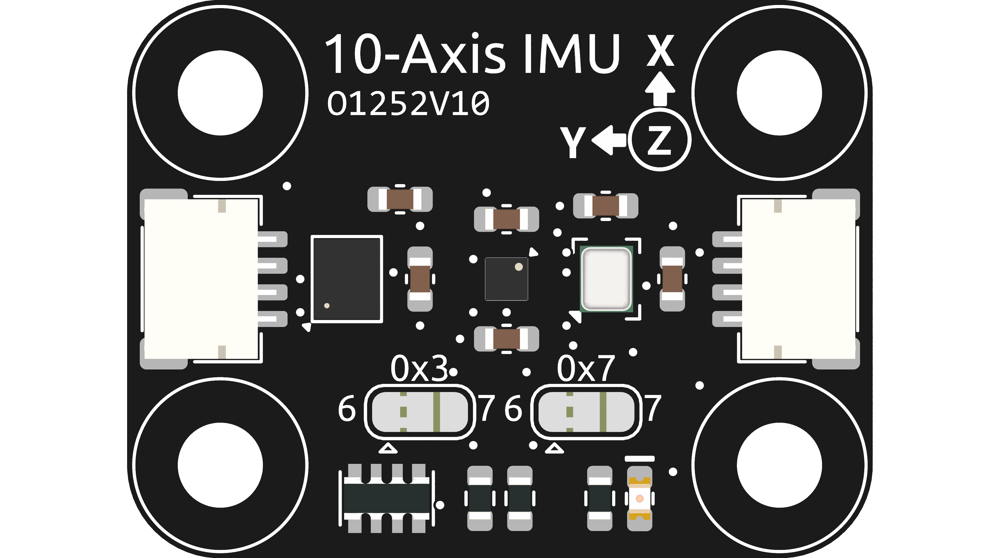

.. note::

    Hello, welcome to the SunFounder Raspberry Pi & Arduino & ESP32 Enthusiasts Community on Facebook! Dive deeper into Raspberry Pi, Arduino, and ESP32 with fellow enthusiasts.

    **Why Join?**

    - **Expert Support**: Solve post-sale issues and technical challenges with help from our community and team.
    - **Learn & Share**: Exchange tips and tutorials to enhance your skills.
    - **Exclusive Previews**: Get early access to new product announcements and sneak peeks.
    - **Special Discounts**: Enjoy exclusive discounts on our newest products.
    - **Festive Promotions and Giveaways**: Take part in giveaways and holiday promotions.

    👉 Ready to explore and create with us? Click [|link_sf_facebook|] and join today!

.. _cpn_10_axis_imu:

10 Axis IMU module
============================

The 10 Axis IMU module is a high-precision, 10-axis (10DOF) module capable of measuring acceleration, angular velocity, and magnetic field strength across three axes: x, y, and z. It consists of three main sensors: SH3001, QMC6310, and spl06_001, and communicates via the I2C protocol.

This module is based on three sensors:

1. **SH3001**: This is a 6-axis accelerometer and gyroscope that can measure acceleration and angular velocity in three axes x, y, and z.
2. **QMC6310**: This is a 3-axis digital compass that can measure the strength of the magnetic field in three axes x, y, and z.
3. **SPL06_001**: This is a barometric temperature and pressure sensor that can measure atmospheric pressure and temperature.

The SH3001 measures acceleration and angular velocity in three axes x, y, and z. The QMC6310 measures the strength of the magnetic field in three axes x, y, and z. The SPL06_001 measures atmospheric pressure and temperature. The data from these sensors are combined to provide accurate information about the orientation of the module in space.

The 10 Axis IMU module is commonly used in applications such as drones, robotics, and other projects that require accurate orientation information. It is compatible with Arduino boards and can be easily interfaced with them using the I2C communication protocol.

