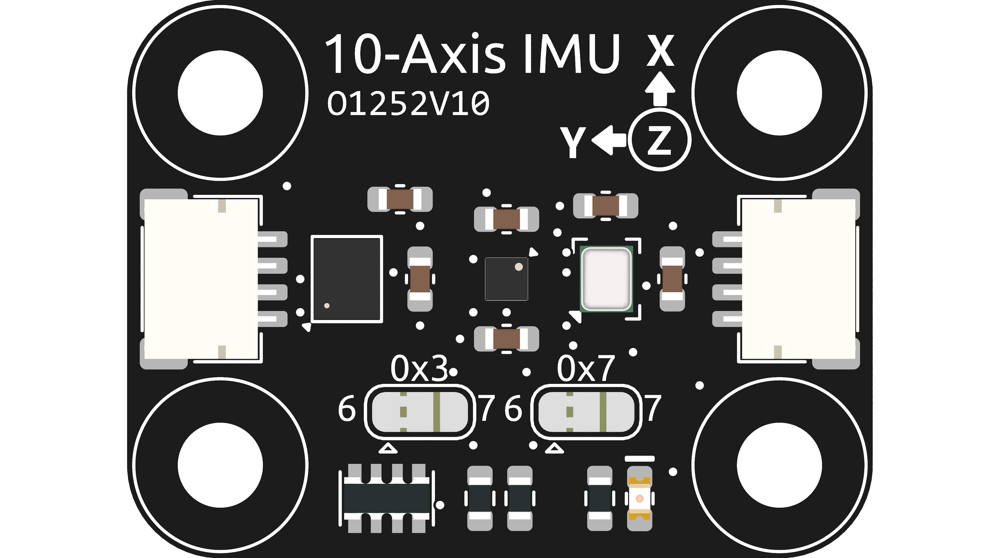

.. note::

    Hallo und willkommen in der SunFounder Raspberry Pi & Arduino & ESP32 Enthusiasten-Gemeinschaft auf Facebook! Tauchen Sie tiefer ein in die Welt von Raspberry Pi, Arduino und ESP32 mit anderen Enthusiasten.

    **Warum beitreten?**

    - **Expertenunterstützung**: Lösen Sie Nachverkaufsprobleme und technische Herausforderungen mit Hilfe unserer Gemeinschaft und unseres Teams.
    - **Lernen & Teilen**: Tauschen Sie Tipps und Anleitungen aus, um Ihre Fähigkeiten zu verbessern.
    - **Exklusive Vorschauen**: Erhalten Sie frühzeitigen Zugang zu neuen Produktankündigungen und exklusiven Einblicken.
    - **Spezialrabatte**: Genießen Sie exklusive Rabatte auf unsere neuesten Produkte.
    - **Festliche Aktionen und Gewinnspiele**: Nehmen Sie an Gewinnspielen und Feiertagsaktionen teil.

    👉 Sind Sie bereit, mit uns zu erkunden und zu erschaffen? Klicken Sie auf [|link_sf_facebook|] und treten Sie heute bei!

.. _cpn_10_axis_imu:

10 Axis IMU module
============================

Das 10 Axis IMU-Modul ist ein hochpräzises 10-Achsen-Modul (10DOF), das Beschleunigung, Winkelgeschwindigkeit und Magnetfeldstärke entlang der drei Achsen x, y und z messen kann. Es besteht aus drei Hauptsensoren: SH3001, QMC6310 und SPL06_001 und kommuniziert über das I2C-Protokoll.

Dieses Modul basiert auf drei Sensoren:

1. **SH3001**: Ein 6-Achsen-Beschleunigungs- und Gyroskopsensor, der Beschleunigung und Winkelgeschwindigkeit entlang der drei Achsen x, y und z messen kann.
2. **QMC6310**: Ein digitaler 3-Achsen-Kompass, der die Magnetfeldstärke entlang der drei Achsen x, y und z messen kann.
3. **SPL06_001**: Ein barometrischer Temperatur- und Drucksensor zur Messung von Luftdruck und Temperatur.

Der SH3001 misst Beschleunigung und Winkelgeschwindigkeit entlang der drei Achsen x, y und z. Der QMC6310 misst die Magnetfeldstärke entlang der drei Achsen x, y und z. Der SPL06_001 misst den atmosphärischen Druck sowie die Temperatur. Die von diesen Sensoren erfassten Daten werden kombiniert, um präzise Informationen über die räumliche Ausrichtung des Moduls zu liefern.

Das 10 Axis IMU-Modul wird häufig in Anwendungen wie Drohnen, Robotiksystemen und anderen Projekten eingesetzt, bei denen genaue Lage- und Orientierungsinformationen erforderlich sind. Es ist mit Arduino-Boards kompatibel und lässt sich über das I2C-Kommunikationsprotokoll einfach integrieren.