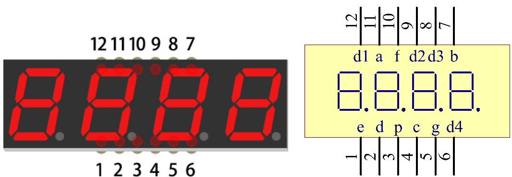
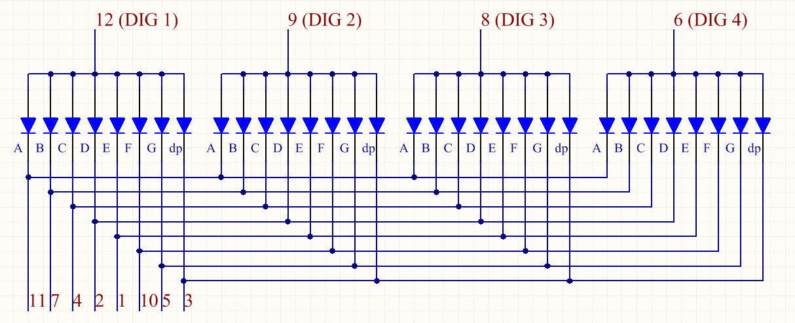
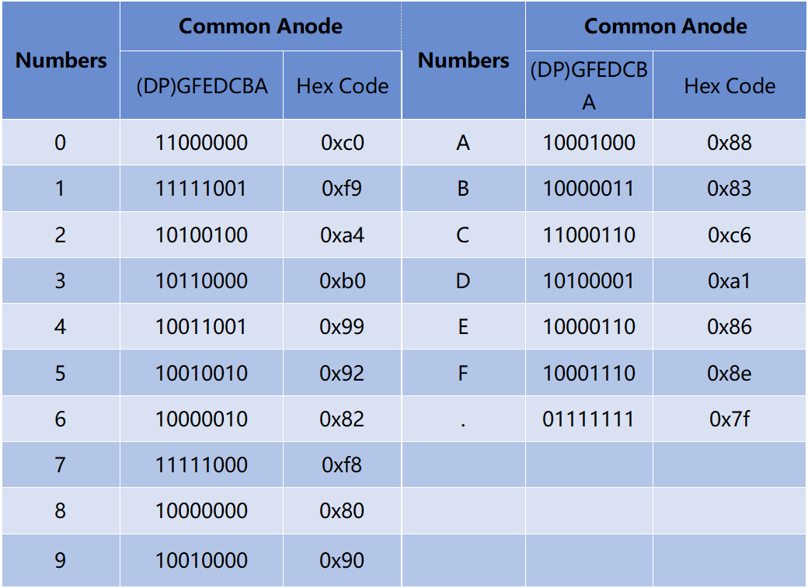

.. _cpn_4_digit:

4 位数码管
===========

4 位数码管由四个 7 段数码管共同工作组成。

它利用人眼视觉暂留原理，快速循环显示每个数码管的字符，从而形成连续的字符串。

例如，当数码管显示"1234"时，第一个 7 段数码管显示"1"，而"234"不显示。一段时间后，第二个数码管显示"2"，第一、三、四个数码管不显示，依此类推，四个数码管轮流显示。这个过程非常短暂（通常为 5ms），由于光学余辉效应和视觉残留原理，我们能够同时看到四个字符。

**显示代码**

为了帮助您了解 7 段数码管（共阳极）如何显示数字，我们绘制了以下表格。数字 0-F 显示在 7 段数码管上；(DP) GFEDCBA 表示对应的 LED 设置为 0 或 1，例如，11000000 表示 DP 和 G 设置为 1，而其他设置为 0。因此，数字 0 显示在 7 段数码管上，HEX Code 对应十六进制数。

.. **Example**

.. * :ref:`1.1.5_c` (C Project)
.. * :ref:`3.1.1_c` (C Project)
.. * :ref:`3.1.6_c` (C Project)
.. * :ref:`3.1.12_c` (C Project)
.. * :ref:`1.1.5_py` (Python Project)
.. * :ref:`4.1.3_py` (Pyhton Project)
.. * :ref:`4.1.7_py` (Pyhton Project)
.. * :ref:`4.1.12_py` (Pyhton Project)
.. * :ref:`4.1.18_py` (Pyhton Project)
