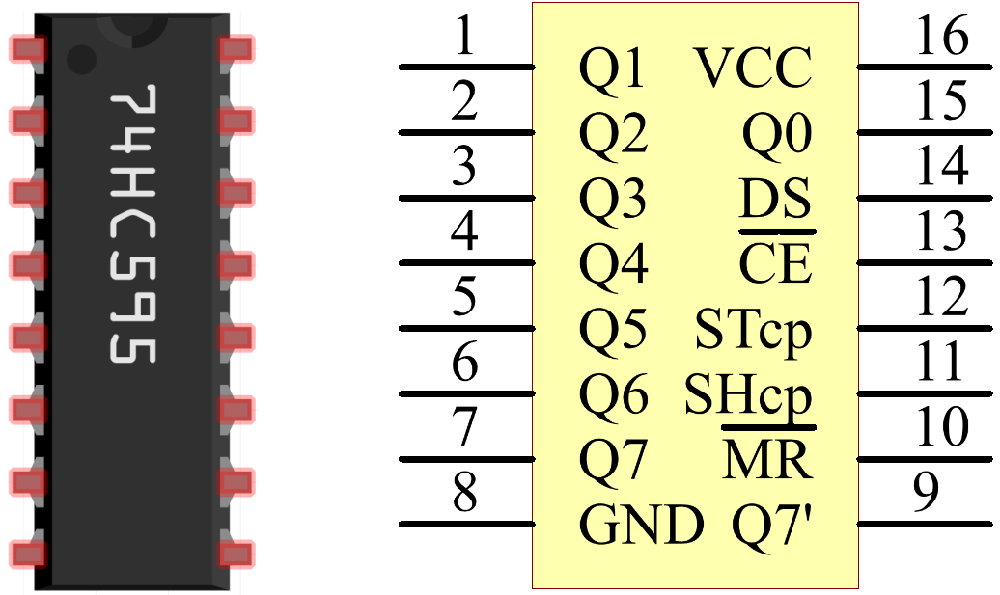

.. _cpn_74hc595:

74HC595
===========

.. image:: img/74HC595.png

74HC595 包含一个 8 位移位寄存器和一个具有三态并行输出的存储寄存器。它将串行输入转换为并行输出，从而节省 MCU 的 IO 端口。
当 MR（引脚 10）为高电平且 OE（引脚 13）为低电平时，数据在 SHcp 的上升沿输入，并通过 SHcp 的上升沿进入存储寄存器。如果两个时钟连接在一起，移位寄存器始终比存储寄存器早一个脉冲。存储寄存器有一个串行移位输入引脚 (DS)、一个串行输出引脚 (Q) 和一个异步复位端（低电平）。存储寄存器输出一个具有并行 8 位三态的总线。当 OE 使能（低电平）时，存储寄存器中的数据输出到总线。

* `74HC595 Datasheet <https://www.ti.com/lit/ds/symlink/cd74hc595.pdf?ts=1617341564801>`_

74HC595 的引脚及其功能：

* **Q0-Q7**\ ：8 位并行数据输出引脚，可直接控制 8 个 LED 或 7 段数码管的 8 个引脚。
* **Q7'**\ ：串行输出引脚，连接到另一个 74HC595 的 DS 引脚，用于级联多个 74HC595。
* **MR**\ ：复位引脚，低电平有效。
* **SHcp**\ ：移位寄存器时序输入。在上升沿，移位寄存器中的数据依次移动一位，即 Q1 的数据移至 Q2，依此类推。在下降沿，移位寄存器中的数据保持不变。
* **STcp**\ ：存储寄存器时序输入。在上升沿，移位寄存器中的数据移入存储寄存器。
* **CE**\ ：输出使能引脚，低电平有效。
* **DS**\ ：串行数据输入引脚。
* **VCC**\ ：正电源电压。
* **GND**\ ：接地。

.. **Example**

.. * :ref:`1.1.4_c` (C Project)
.. * :ref:`1.1.5_c` (C Project)
.. * :ref:`3.1.1_c` (C Project)
.. * :ref:`3.1.6_c` (C Project)
.. * :ref:`3.1.12_c` (C Project)
.. * :ref:`1.1.4_py` (Python Project)
.. * :ref:`1.1.5_py` (Python Project)
.. * :ref:`4.1.7_py` (Pyhton Project)
.. * :ref:`4.1.12_py` (Python Project)
.. * :ref:`4.1.18_py` (Pyhton Project)
