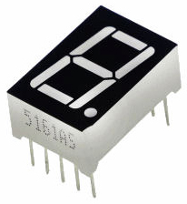
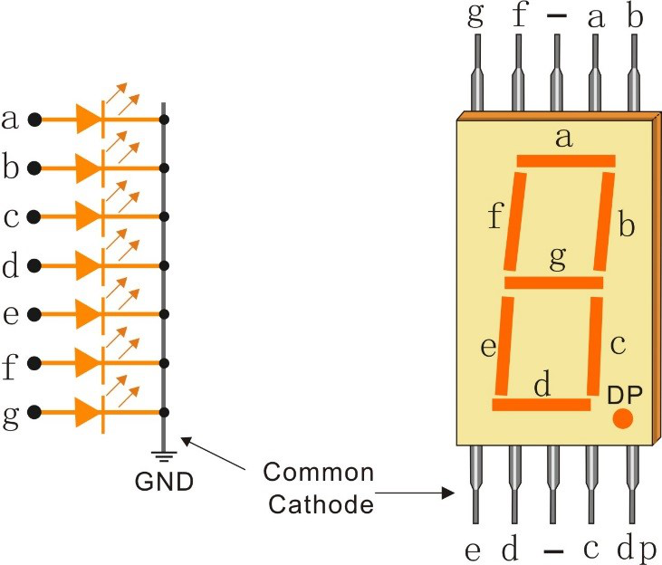

.. _cpn_7_segment:

7 段数码管
==========

7 段数码管是一种 8 字形元件，内部封装了 7 个 LED。每个 LED 称为一个段——通电时，一个段形成要显示的数字的一部分。

引脚连接方式有两种：共阴极（CC）和共阳极（CA）。顾名思义，CC 显示器将所有 7 个 LED 的阴极连接在一起，而 CA 显示器将所有 7 个段的阳极连接在一起。

本套件使用共阴极 7 段数码管，以下是其电子符号。

显示器中的每个 LED 都有一个位置段，其中一根连接引脚从矩形塑料封装中引出。这些 LED 引脚标记为 "a" 到 "g"，分别代表每个 LED。另一端的 LED 引脚连接在一起形成公共引脚。因此，通过按特定顺序正向偏置 LED 段的相应引脚，某些段会点亮，其他段保持熄灭，从而在显示器上显示相应的字符。

**显示代码**

为了帮助您了解 7 段数码管（共阴极）如何显示数字，我们绘制了以下表格。数字 0-F 显示在 7 段数码管上；(DP) GFEDCBA 表示对应的 LED 设置为 0 或 1，例如，00111111 表示 DP 和 G 设置为 0，而其他设置为 1。因此，数字 0 显示在 7 段数码管上，HEX Code 对应十六进制数。

.. image:: img/segment_code.png

.. **Example**

.. * :ref:`1.1.4_c` (C Project)
.. * :ref:`1.1.4_py` (Python Project)
