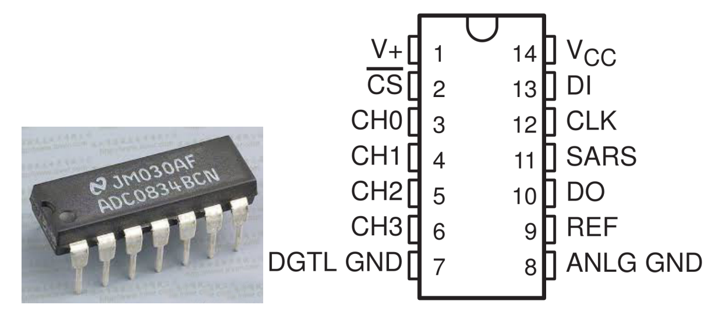
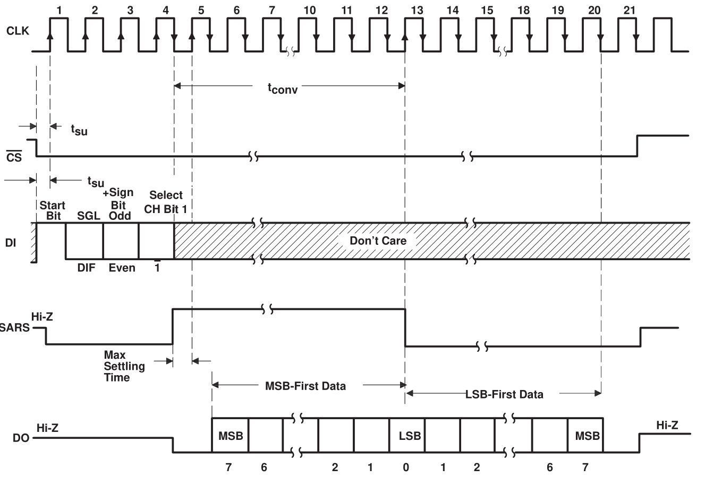
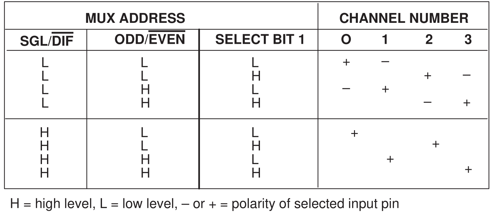

.. _cpn_adc0834:

ADC0834
==============

ADC0834 是一款 8 位逐次逼近型模数转换器，配备输入可配置的多通道多路复用器和串行输入/输出接口。串行输入/输出设计用于与标准移位寄存器或微处理器接口。

**操作时序**

转换通过将 CS 置为低电平来启动，这将启用所有逻辑电路。CS 必须在整个转换过程中保持低电平。然后从处理器接收时钟输入。在每个时钟输入的低到高跳变沿，DI 上的数据被时钟送入多路复用器地址移位寄存器。输入的第一个逻辑高电平为起始位。起始位之后是 3 到 4 位的分配字。在每个后续时钟输入的低到高跳变沿，起始位和分配字通过移位寄存器移位。当起始位移入多路复用器寄存器的起始位置时，输入通道被选中，转换开始。SAR 状态输出 (SARS) 变为高电平，表示转换正在进行，并且在转换期间禁用 DI 到多路复用器移位寄存器。

自动插入一个时钟周期的间隔，以允许选中的多路复用通道稳定。数据输出 DO 脱离高阻态，并在这一时钟周期的多路复用器稳定时间内提供前导低电平。SAR 比较器将电阻阶梯网络的逐次输出与输入的模拟信号进行比较。比较器输出指示模拟输入是大于还是小于电阻阶梯网络输出。随着转换的进行，转换数据同时从 DO 输出引脚输出，最高有效位 (MSB) 优先。

经过八个时钟周期后，转换完成，SARS 输出变为低电平。最后在 MSB 优先数据流之后输出最低有效位优先的数据。

**ADC0834 MUX 地址控制逻辑表**

* `ADC0831 series Datasheet <https://www.ti.com/lit/ds/symlink/adc0831-n.pdf>`_

.. **Example**

.. * :ref:`2.1.7_c` (C Project)
.. * :ref:`2.2.1_c` (C Project)
.. * :ref:`2.2.2_c` (C Project)
.. * :ref:`3.1.4_c` (C Project)
.. * :ref:`3.1.5_c` (C Project)
.. * :ref:`3.1.7_c` (C Project)
.. * :ref:`2.1.7_py` (Python Project)
.. * :ref:`2.2.1_py` (Pyhton Project)
.. * :ref:`2.2.2_py` (Pyhton Project)
.. * :ref:`4.1.10_py` (Pyhton Project)
.. * :ref:`4.1.11_py` (Pyhton Project)
.. * :ref:`4.1.13_py` (Pyhton Project)
