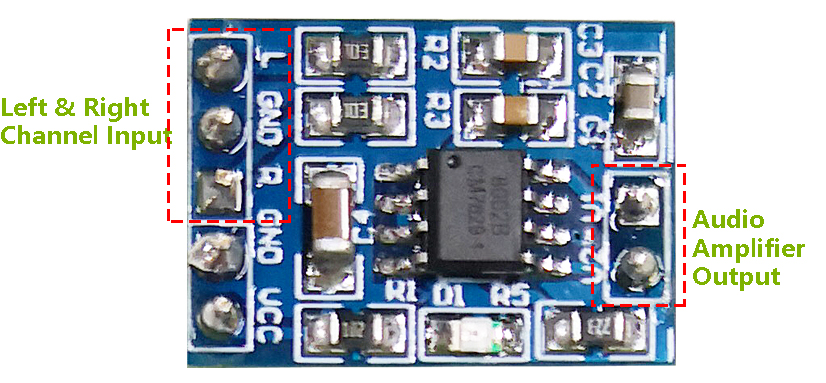
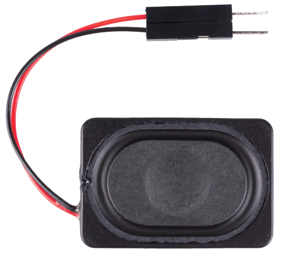
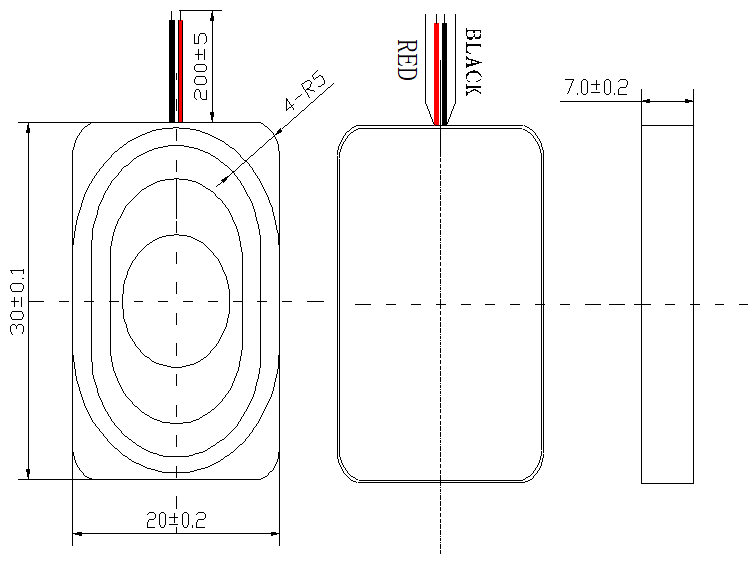
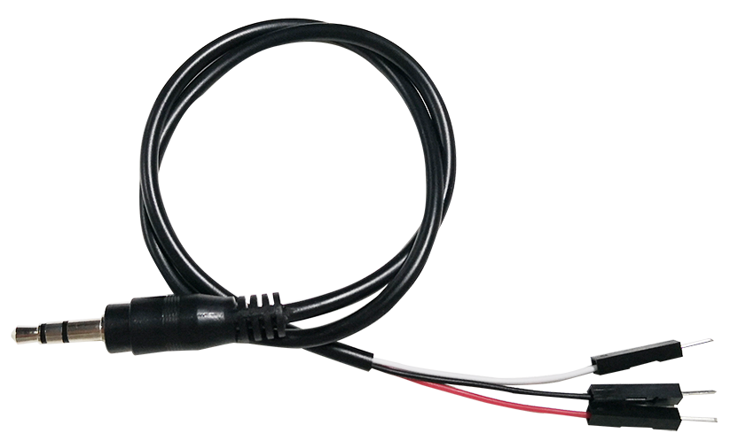
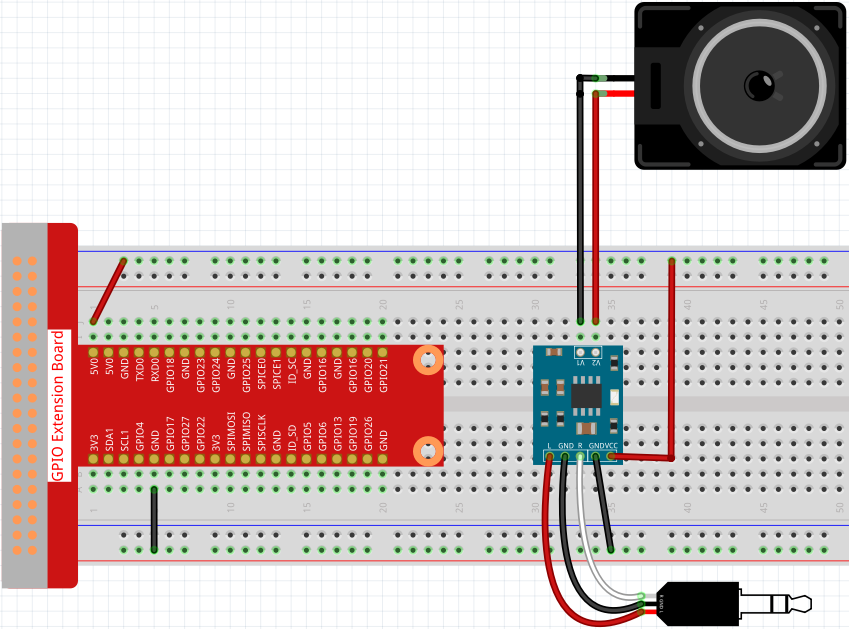
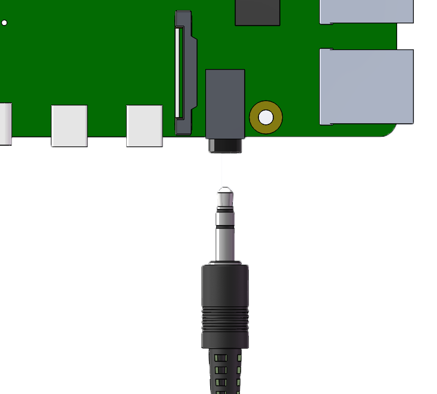

.. _cpn_audio_speaker:

音频模块与扬声器
=================

**音频功放模块**

音频功放模块包含一颗 HXJ8002 音频功率放大芯片。该芯片是一款低电源功率放大器，可在 5V 直流电源下为 3Ω BTL 负载提供 3W 平均音频功率，且谐波失真低（1KHz 下失真低于 10%）。该芯片无需任何耦合电容或自举电容即可放大音频信号。

该模块可由 2.0V 至 5.5V 直流电源供电，工作电流为 10mA（典型待机电流为 0.6μA），可为 3Ω、4Ω 或 8Ω 阻抗的扬声器提供强大的放大声音。该模块具有改进的爆破音和咔嗒声抑制电路，可显著减少通电和断电瞬间的过渡噪声。小巧的尺寸以及高效率和低供电要求使其适用于便携式、电池供电的项目和微控制器。

* **IC**\ ：HXJ8002
* **输入电压**\ ：2V ~ 5.5V
* **待机电流**\ ：0.6μA（典型值）
* **输出功率**\ ：3W（3Ω 负载）、2.5W（4Ω 负载）、1.5W（8Ω 负载）
* **扬声器输出阻抗**\ ：3Ω、4Ω、8Ω
* **尺寸**\ ：19.8mm x 14.2mm

**扬声器**

* **尺寸**\ ：20x30x7mm
* **阻抗**\ ：8Ω
* **额定输入功率**\ ：1.5W
* **最大输入功率**\ ：2.0W
* **线长**\ ：10cm

尺寸图如下：

* :download:`2030 Speaker Datasheet <https://github.com/sunfounder/sf-pdf/raw/master/datasheet/2030-speaker-datasheet.pdf>`

**音频线**

这是一根 3.5mm 公头音频线，总长度为 43cm。它有 3 个接头，红色用于左声道，白色用于右声道，中间为 GND。

**电路**

按照上图搭建电路后，将音频线插入 Raspberry Pi 的 3.5mm 音频接口。

.. **Example**

.. * :ref:`3.1.3_py` (Python Project)
.. * :ref:`3.1.4_py` (Python Project)
.. * :ref:`4.1.2_py` (Python Project)
.. * :ref:`4.1.3_py` (Python Project)
.. * :ref:`4.1.5_py` (Python Project)
.. * :ref:`1.8_scratch` (Scratch Project)
.. * :ref:`1.9_scratch` (Scratch Project)
.. * :ref:`1.10_scratch` (Scratch Project)
