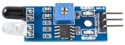

.. note::

    Hallo und willkommen in der SunFounder Raspberry Pi & Arduino & ESP32 Enthusiasten-Gemeinschaft auf Facebook! Tauchen Sie tiefer ein in die Welt von Raspberry Pi, Arduino und ESP32 mit anderen Enthusiasten.

    **Warum beitreten?**

    - **Expertenunterstützung**: Lösen Sie Nachverkaufsprobleme und technische Herausforderungen mit Hilfe unserer Gemeinschaft und unseres Teams.
    - **Lernen & Teilen**: Tauschen Sie Tipps und Anleitungen aus, um Ihre Fähigkeiten zu verbessern.
    - **Exklusive Vorschauen**: Erhalten Sie frühzeitigen Zugang zu neuen Produktankündigungen und exklusiven Einblicken.
    - **Spezialrabatte**: Genießen Sie exklusive Rabatte auf unsere neuesten Produkte.
    - **Festliche Aktionen und Gewinnspiele**: Nehmen Sie an Gewinnspielen und Feiertagsaktionen teil.

    👉 Sind Sie bereit, mit uns zu erkunden und zu erschaffen? Klicken Sie auf [|link_sf_facebook|] und treten Sie heute bei!

.. _cpn_avoid_module:

Hindernisvermeidungsmodul
===========================================

Das IR-Hindernisvermeidungsmodul ist sehr anpassungsfähig gegenüber Umgebungslicht und verfügt über ein Paar Infrarot-Sendungs- und Empfangsrohre.

Die Sendungsröhre sendet Infrarotfrequenzen aus. Trifft die Detektionsrichtung auf ein Hindernis, wird die Infrarotstrahlung von der Empfangsröhre aufgenommen. 
Nach der Verarbeitung durch den Komparator-Schaltkreis leuchtet die grüne Anzeige auf und gibt ein niedriges Signal aus.

Die Erkennungsentfernung kann mittels Potentiometer eingestellt werden, wobei der effektive Entfernungsbereich zwischen 2 und 30 cm liegt.

.. image:: img/IR_module.png
    :width: 600
    :align: center

.. **Beispiel**

.. * :ref:`2.2.5_c` (C-Projekt)
.. * :ref:`2.2.5_py` (Python-Projekt)
.. * :ref:`1.11_scratch` (Scratch-Projekt)
