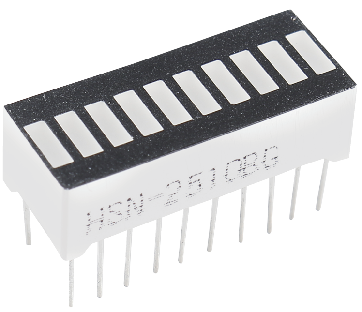
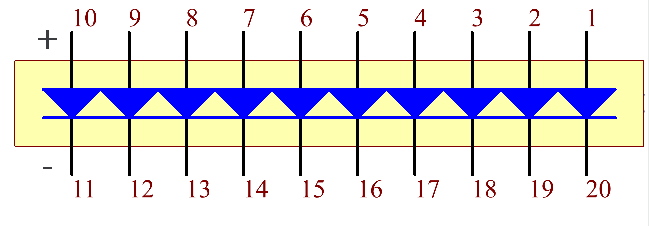

.. _cpn_bar_graph:

LED 条形图
=============

LED 条形图是一种 LED 阵列，用于连接电子电路或微控制器。将 LED 条形图连接到电路就像用 10 个输出引脚连接 10 个独立 LED 一样简单。通常，我们可以将 LED 条形图用作电池电量指示器、音频设备和工业控制面板。LED 条形图还有许多其他应用。

以下是 LED 条形图的内部原理图。一般来说，带有标签的一面为阳极，另一面为阴极。

.. **Example**

.. * :ref:`1.1.3_c` (C Project)
.. * :ref:`3.1.5_c` (C Project)
.. * :ref:`1.1.3_py` (Python Project)
.. * :ref:`4.1.11_py` (Python Project)
.. * :ref:`1.12_scratch` (Scratch Project)
