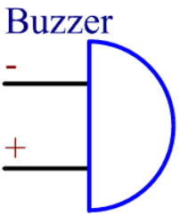

.. _cpn_buzzer:

蜂鸣器
=======

.. image:: img/buzzer.png
    :width: 600

蜂鸣器是一种结构一体化的电子蜂鸣器，采用直流电源供电，广泛应用于计算机、打印机、复印机、报警器、电子玩具、汽车电子设备、电话、定时器及其他电子产品或语音设备中。

蜂鸣器可分为有源和无源两种（见下图）。将蜂鸣器引脚朝上翻转，绿色电路板的是无源蜂鸣器，黑色胶体封装的是有源蜂鸣器。

有源蜂鸣器和无源蜂鸣器的区别：

有源蜂鸣器内部含有振荡源，因此通电后会发出声音。而无源蜂鸣器内部没有振荡源，使用直流信号时不会发声；需要使用频率在 2K 到 5K 之间的方波来驱动。有源蜂鸣器由于内置了多个振荡电路，通常比无源蜂鸣器更贵。

以下是蜂鸣器的电气符号。它有两个引脚，分为正极和负极。表面标有 "+" 的为正极，另一极为负极。

您可以检查蜂鸣器的引脚，较长的是正极，较短的是负极。连接时请不要接反，否则蜂鸣器不会发声。

`Buzzer - Wikipedia <https://en.wikipedia.org/wiki/Buzzer>`_

.. **Example**

.. * :ref:`1.2.1_c` (C Project)
.. * :ref:`1.2.2_c` (C Project)
.. * :ref:`1.2.1_py` (Python Project)
.. * :ref:`1.2.2_py` (Python Project)
.. * :ref:`1.13_scratch` (Scratch Project)
.. * :ref:`1.14_scratch` (Scratch Project)
