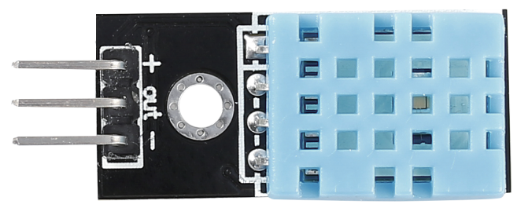

.. _cpn_humiture_sensor:

温湿度传感器模块
=============================

数字温湿度传感器 DHT11 是一款复合传感器，包含校准后的数字温湿度信号输出。
该产品采用了专用数字模块采集技术和温湿度传感技术，确保具有高可靠性和优异的长期稳定性。

只有三个引脚可供使用：VCC、GND 和 DATA。
通信过程始于 DATA 线向 DHT11 发送起始信号，DHT11 接收信号后返回应答信号。
然后主机接收应答信号，开始接收 40 位的温湿度数据（8 位湿度整数 + 8 位湿度小数 + 8 位温度整数 + 8 位温度小数 + 8 位校验和）。

.. image:: img/Dht11.png

* `DHT11 Datasheet <https://components101.com/sites/default/files/component_datasheet/DHT11-Temperature-Sensor.pdf>`_

.. **Example**

.. * :ref:`2.2.3_c` (C Project)
.. * :ref:`2.2.3_py` (Python Project)
