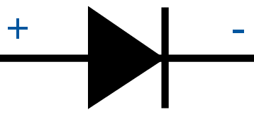
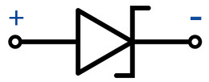

.. _cpn_diode:

二极管
=================

二极管是一种具有两个电极的电子元件。它允许电流仅沿一个方向流动，这通常被称为"整流"功能。
因此，二极管可被视为电子版的单向阀。

由于其单向导电性，二极管几乎应用于所有有一定复杂度的电子电路中。它是最早的半导体器件之一，应用范围广泛。

根据用途分类，可分为检波二极管、整流二极管、限幅二极管、稳压二极管等。

本套件中包含整流二极管和稳压二极管。

**整流二极管**

.. image:: img/in4007_diode.png

整流二极管是一种半导体二极管，用于通过整流桥电路将交流电（AC）整流为直流电（DC）。通过肖特基势垒替代的整流二极管主要在数字电子中具有价值。该二极管能够导通从 mA 到数 kA 的电流值和高达数 kV 的电压值。

整流二极管可采用硅材料制造，能够导通大电流值。这些二极管虽不那么常见，但仍使用锗或砷化镓基半导体二极管。锗二极管的允许反向电压较低，允许结温也较低。锗二极管相比硅二极管的优点是正向偏置工作时阈值电压较低。

* `1N400x general-purpose diode - Wikipedia <https://en.wikipedia.org/wiki/1N400x_general-purpose_diode>`_

**稳压二极管**

稳压二极管是一种特殊类型的二极管，设计用于在达到特定反向电压（称为稳压值）时，可靠地允许电流"反向"流动。

该二极管是一种半导体器件，在达到临界反向击穿电压之前具有非常高的电阻。在此临界击穿点，反向电阻减小到很小的值，电流增加而电压在该低电阻区域内保持恒定。

.. image:: img/zener_diode.png

* `Zener diode - Wikipedia <https://en.wikipedia.org/wiki/Zener_diode>`_

.. **Example**

.. * :ref:`1.3.3_c` (C Project)
.. * :ref:`1.3.3_py` (Python Project)
