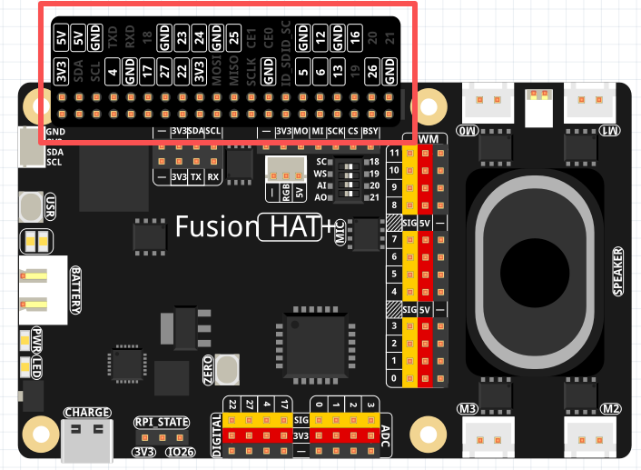

.. note::

    Hello, welcome to the SunFounder Raspberry Pi & Arduino & ESP32 Enthusiasts Community on Facebook! Dive deeper into Raspberry Pi, Arduino, and ESP32 with fellow enthusiasts.

    **Why Join?**

    - **Expert Support**: Solve post-sale issues and technical challenges with help from our community and team.
    - **Learn & Share**: Exchange tips and tutorials to enhance your skills.
    - **Exclusive Previews**: Get early access to new product announcements and sneak peeks.
    - **Special Discounts**: Enjoy exclusive discounts on our newest products.
    - **Festive Promotions and Giveaways**: Take part in giveaways and holiday promotions.

    👉 Ready to explore and create with us? Click [|link_sf_facebook|] and join today!

.. _cpn_fusion_hat:

Fusion HAT+
=====================================

.. image:: img/fusionhat_v0.png
    :width: 500
    :align: center
   

The Fusion HAT+ is a powerful and versatile expansion board designed to effortlessly transform a Raspberry Pi into a fully functional robot with minimal setup, and it can also support advanced automation projects. 

At the heart of the Fusion HAT+ is an onboard microcontroller (MCU), which significantly extends the Raspberry Pi’s native functionality by providing additional PWM outputs and ADC inputs—capabilities that are typically absent on standard Raspberry Pi models. This allows developers to achieve more precise motor control and sensor integration.

Compact in size yet rich in functionality, the Fusion HAT+ integrates four motor driver chips, supporting independent control of up to four DC motors. It also features a digital I2S audio module and a built-in mono speaker, enabling high-quality audio playback and interactive sound features directly from the board.

The board accepts a 6.0V to 8.4V power input via a 3-pin XH2.54 connector. It includes two power indicator LEDs for monitoring system status, a user-programmable LED for custom signaling, and a convenient onboard buttons for immediate function testing or input simulation—making development and debugging more efficient and user-friendly.

.. |link_fusion_hat| raw:: html

    <a href="https://docs.sunfounder.com/projects/fusion-hat/en/latest/" target="_blank">SunFounder Fusion HAT+</a>

For detailed instructions, please refer to: |link_fusion_hat|.

Pinpal
============================

.. image:: img/pinpal_pic.png
    :width: 20%
    :align: center

PinPal is a small PCB board designed by SunFounder with Raspberry Pi pin labels.  
You can place it directly onto the pin header of the Fusion HAT+, making it easy to identify each pin’s function clearly and quickly while building your project.  
This helps reduce mistakes and speeds up wiring.

Some pins on PinPal are **not recommended for direct use** because they are already used by the Fusion HAT+ or share functions that may cause conflicts.

#. **SDA / SCL — I2C (GPIO2 / GPIO3)**

   * Raspberry Pi’s main I2C pins.  
   * Fusion HAT+ also provides a P2.54 I2C header and an SH1.0 Qwiic/STEMMA QT port.  
   * All three share the same bus, so **only one can be used at a time**.

   .. image:: img/pinpal_i2c.png
       :width: 80%
       :align: center

#. **TXD / RXD — UART (GPIO14 / GPIO15)**

   * Raspberry Pi’s main UART pins.  
   * Fusion HAT+ includes another UART header, sharing the same pins—**choose only one**.

   .. image:: img/pinpal_uart.png
       :width: 80%
       :align: center

#. **GPIO 17 / 4 / 27 / 22 — General GPIO**

   * Fusion HAT+ provides an extra set of these pins, but they map to the same Raspberry Pi GPIOs.  
   * **Use only one group** to avoid conflicts.

   .. image:: img/pinpal_gpio.png
       :width: 80%
       :align: center

#. **MOSI / MISO / SCLK / CE0 / GPIO6 — SPI Pins**

   * Fusion HAT+ provides another SPI header.  
   * The RGB (WS2812) connector uses the MOSI pin.  
   * **Use only one SPI group** to prevent conflicts.

   .. list-table::
      :header-rows: 1

      * - Signal
        - Pin Mapping
      * - BSY
        - GPIO6
      * - CS
        - CE0 / GPIO8
      * - SCK
        - SCLK / GPIO11
      * - MI
        - MISO / GPIO9
      * - MO
        - MOSI / GPIO10

   .. image:: img/pinpal_spi.png
       :width: 80%
       :align: center

#. **GPIO 18 / 19 / 20 / 21 — I2S Audio Pins**

   * Fusion HAT+ includes onboard I2S audio (speaker + microphone). More details:  
     `I2S <https://docs.sunfounder.com/projects/fusion-hat/en/latest/hardware/interfaces.html#speaker-and-mic>`_.
   * You may reuse these pins only when the audio system is switched off.
   * **Do not use WS or SCLK while audio components are active.**

   .. image:: img/pinpal_i2s.png
       :width: 80%
       :align: center

   .. list-table::
      :header-rows: 1

      * - Signal
        - Raspberry Pi Pin
      * - WS
        - GPIO19
      * - SCLK
        - GPIO18
      * - Audio OUT (Speaker)
        - GPIO21
      * - Audio IN (MIC)
        - GPIO20

#. **ID_SD / ID_SC — HAT EEPROM Pins**

   These pins are reserved for the Raspberry Pi HAT EEPROM, which stores board identification data.  
   Fusion HAT+ uses these pins for its onboard EEPROM, so **ID_SD (GPIO0) and ID_SC (GPIO1) must not be used for any other purpose**.

   .. image:: img/pinpal_eeprom.png
       :width: 80%
       :align: center
   

