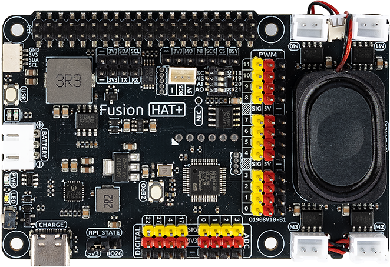
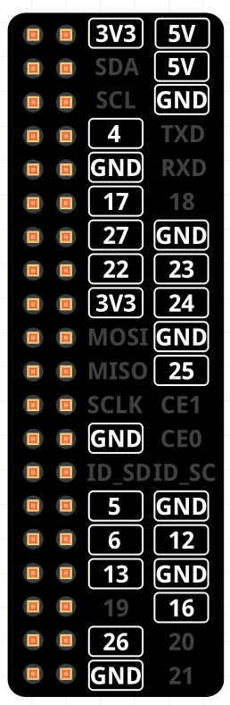
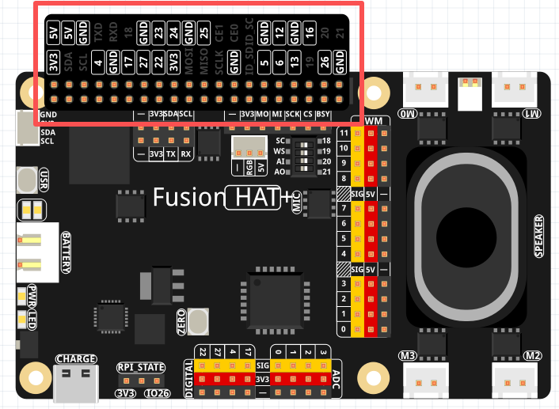

.. _cpn_fusion_hat:

Fusion HAT+
=====================================

Fusion HAT+ 是一款功能强大且多用途的扩展板，旨在以最少的配置轻松将 Raspberry Pi 转变为功能完整的机器人，同时也能支持高级自动化项目。

Fusion HAT+ 的核心是一块板载微控制器（MCU），它通过提供额外的PWM输出和ADC输入，显著扩展了Raspberry Pi的原生功能——这些功能在标准Raspberry Pi型号上通常不具备。这使得开发者能够实现更精确的电机控制和传感器集成。

Fusion HAT+ 体积紧凑但功能丰富，集成了四个电机驱动芯片，支持独立控制多达四个直流电机。它还配备了一个数字I2S音频模块和一个内置单声道扬声器，可直接从板子上实现高质量音频播放和交互式声音功能。

该板通过3针XH2.54连接器接受6.0V至8.4V的电源输入。它包含两个电源指示灯LED用于监控系统状态，一个用户可编程LED用于自定义信号指示，以及一个方便的内置按钮用于即时功能测试或输入模拟——使开发和调试更加高效和用户友好。

.. |link_fusion_hat| raw:: html

    <a href="https://docs.sunfounder.com/projects/fusion-hat/en/latest/" target="_blank">SunFounder Fusion HAT+</a>

有关详细说明，请参考：|link_fusion_hat|。

PinPal
============================

PinPal 是 SunFounder 设计的小型PCB板，带有 Raspberry Pi 引脚标签。
你可以将其直接放置在 Fusion HAT+ 的排针上，从而在构建项目时清晰快速地识别每个引脚的功能。
这有助于减少错误并加快布线速度。

PinPal 上的某些引脚**不建议直接使用**，因为它们已被 Fusion HAT+ 占用或共享可能导致冲突的功能。

#. **SDA / SCL — I2C (GPIO2 / GPIO3)**

   * Raspberry Pi 的主 I2C 引脚。
   * Fusion HAT+ 还提供了 P2.54 I2C 排针和 SH1.0 Qwiic/STEMMA QT 端口。
   * 三者共享同一总线，因此**一次只能使用一个**。

   .. image:: img/pinpal_i2c.png
       :width: 80%
       :align: center

#. **TXD / RXD — UART (GPIO14 / GPIO15)**

   * Raspberry Pi 的主 UART 引脚。
   * Fusion HAT+ 包含另一个 UART 排针，共享相同引脚——**只选一个使用**。

   .. image:: img/pinpal_uart.png
       :width: 80%
       :align: center

#. **GPIO 17 / 4 / 27 / 22 — 通用 GPIO**

   * Fusion HAT+ 提供了这些引脚的额外一组，但它们映射到相同的 Raspberry Pi GPIO。
   * **仅使用一组**以避免冲突。

   .. image:: img/pinpal_gpio.png
       :width: 80%
       :align: center

#. **MOSI / MISO / SCLK / CE0 / GPIO6 — SPI 引脚**

   * Fusion HAT+ 提供另一个 SPI 排针。
   * RGB（WS2812）连接器使用 MOSI 引脚。
   * **仅使用一组 SPI** 以防止冲突。

   .. list-table::
      :header-rows: 1

      * - 信号
        - 引脚映射
      * - BSY
        - GPIO6
      * - CS
        - CE0 / GPIO8
      * - SCK
        - SCLK / GPIO11
      * - MI
        - MISO / GPIO9
      * - MO
        - MOSI / GPIO10

   .. image:: img/pinpal_spi.png
       :width: 80%
       :align: center

#. **GPIO 18 / 19 / 20 / 21 — I2S 音频引脚**

   * Fusion HAT+ 包含板载 I2S 音频（扬声器 + 麦克风）。更多详情：
     `I2S <https://docs.sunfounder.com/projects/fusion-hat/en/latest/hardware/interfaces.html#speaker-and-mic>`_。
   * 只有在音频系统关闭时才能复用这些引脚。
   * **音频组件激活时不要使用 WS 或 SCLK。**

   .. image:: img/pinpal_i2s.png
       :width: 80%
       :align: center

   .. list-table::
      :header-rows: 1

      * - 信号
        - Raspberry Pi 引脚
      * - WS
        - GPIO19
      * - SCLK
        - GPIO18
      * - 音频输出（扬声器）
        - GPIO21
      * - 音频输入（MIC）
        - GPIO20

#. **ID_SD / ID_SC — HAT EEPROM 引脚**

   这些引脚保留用于 Raspberry Pi HAT EEPROM，用于存储板卡识别数据。
   Fusion HAT+ 使用这些引脚用于其板载 EEPROM，因此**ID_SD (GPIO0) 和 ID_SC (GPIO1) 不能用于任何其他用途**。

   .. image:: img/pinpal_eeprom.png
       :width: 80%
       :align: center

