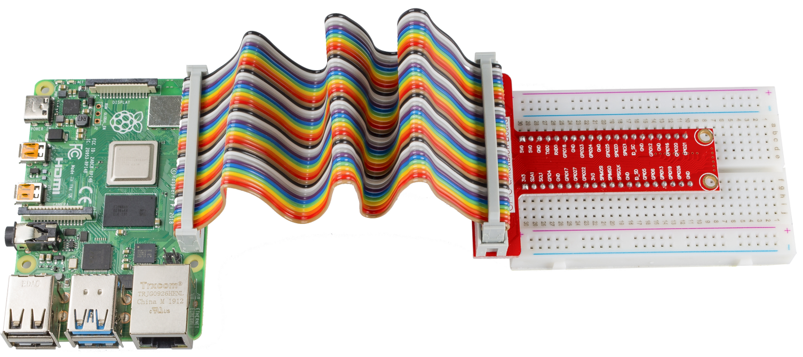
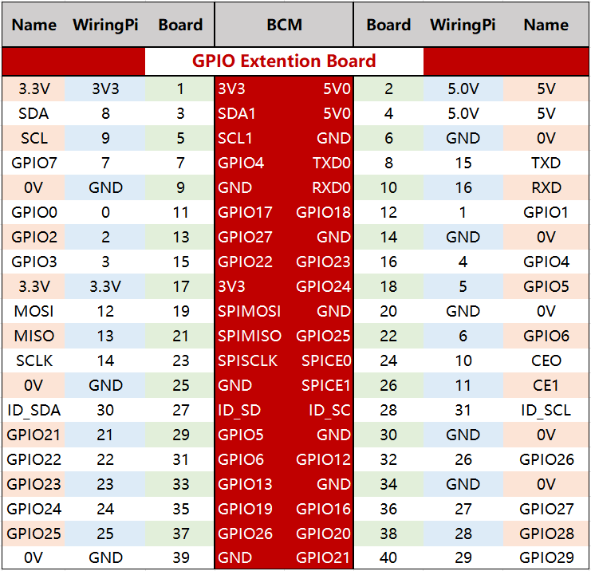

.. note::

    ¡Hola! Bienvenido a la comunidad de entusiastas de SunFounder Raspberry Pi, Arduino y ESP32 en Facebook. Sumérgete en el mundo de Raspberry Pi, Arduino y ESP32 con otros entusiastas.

    **¿Por qué unirse?**

    - **Soporte experto**: Resuelve problemas postventa y desafíos técnicos con la ayuda de nuestra comunidad y equipo.
    - **Aprende y comparte**: Intercambia consejos y tutoriales para mejorar tus habilidades.
    - **Avances exclusivos**: Obtén acceso anticipado a nuevos anuncios de productos y adelantos.
    - **Descuentos especiales**: Disfruta de descuentos exclusivos en nuestros productos más nuevos.
    - **Promociones y sorteos festivos**: Participa en sorteos y promociones festivas.

    👉 ¿Listo para explorar y crear con nosotros? Haz clic en [|link_sf_facebook|] y únete hoy mismo!

.. _cpn_gpio_extension_board:
.. _cpn_gpio_board:

Placa de Extensión GPIO
============================

Antes de comenzar a aprender los comandos, primero necesitas saber más sobre los pines 
de la Raspberry Pi, lo cual es clave para el estudio posterior.

Podemos sacar fácilmente los pines de la Raspberry Pi a una placa de pruebas usando la 
Placa de Extensión GPIO para evitar daños en los GPIO causados por enchufes o desconexiones 
frecuentes. Esta es nuestra Placa de Extensión GPIO de 40 pines y el cable GPIO para los 
modelos B+, 2 modelo B, 3 y 4 modelo B de Raspberry Pi.

**Número de Pines**

Los pines de la Raspberry Pi tienen tres formas de nombrarse: wiringPi, BCM y Board.

Entre estos métodos de nomenclatura, la placa de extensión GPIO de 40 pines utiliza el método BCM. Pero para algunos pines especiales, como el puerto I2C y el puerto SPI, se utiliza el nombre que viene con ellos.

La siguiente tabla nos muestra los métodos de nomenclatura de WiringPi, Board y el nombre intrínseco de cada pin en la placa de extensión GPIO. Por ejemplo, para el GPIO17, el método de nomenclatura de Board es 11, el método de nomenclatura de wiringPi es 0, y el método de nomenclatura intrínseca es GPIO0.

.. note::

    1) En lenguaje C, se utiliza el método de nomenclatura wiringPi.
    
    2) En lenguaje Python, los métodos de nomenclatura aplicados son **Board** y **BCM**, y se utiliza la función ``GPIO.setmode()`` para configurarlos.

    3) En Scratch 3 y Processing, el método de nomenclatura aplicado es **BCM**.

