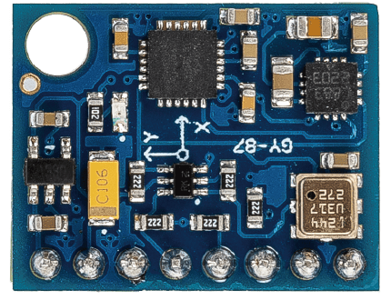

.. _cpn_gy87:

GY-87 IMU模块
============================

GY-87传感器模块是一款高精度的10轴（10DOF）模块，能够测量三轴（x、y、z）的加速度、角速度和磁场强度。它由三个主要传感器组成：MPU6050、QMC5883L和BMP180，通过I2C协议进行通信。

GY-87传感器模块基于三个传感器：

1. **MPU6050**：一款6轴加速度计和陀螺仪，可以测量x、y、z三轴的加速度和角速度。
2. **QMC5883L**：一款3轴数字罗盘，可以测量x、y、z三轴的磁场强度。
3. **BMP180**：一款气压温度传感器，可以测量大气压和温度。

MPU6050测量x、y、z三轴的加速度和角速度。QMC5883L测量x、y、z三轴的磁场强度。BMP180测量大气压和温度。这些传感器的数据被结合起来，提供关于模块在空间中方向的精确信息。

GY-87传感器模块常用于无人机、机器人以及其他需要精确方向信息的项目。它兼容Arduino板，可通过I2C通信协议轻松连接。
