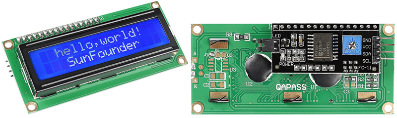

.. _cpn_i2c_lcd:

I2C LCD1602
==============

* **GND**\ ：接地
* **VCC**\ ：电源供电，5V。
* **SDA**\ ：串行数据线。通过上拉电阻连接至 VCC。
* **SCL**\ ：串行时钟线。通过上拉电阻连接至 VCC。

众所周知，虽然 LCD 和其他一些显示器极大地丰富了人机交互，但它们有一个共同的缺点。当连接到控制器时，会占用控制器多个 IO 口，而控制器的外部端口并不充裕，这也限制了控制器的其他功能。

因此，带有 I2C 模块的 LCD1602 应运而生以解决此问题。I2C 模块内置 PCF8574 I2C 芯片，可将 I2C 串行数据转换为并行数据供 LCD 显示。

* `PCF8574 Datasheet <https://www.ti.com/lit/ds/symlink/pcf8574.pdf?ts=1627006546204&ref_url=https%253A%252F%252Fwww.google.com%252F>`_

**I2C 地址**

默认地址通常为 0x27，少数情况下可能为 0x3F。

以默认地址 0x27 为例，可以通过短接 A0/A1/A2 焊盘来修改设备地址；默认状态下 A0/A1/A2 为 1，短接焊盘后 A0/A1/A2 为 0。

.. image:: img/i2c_address.jpg
    :width: 600

**背光/对比度**

背光可通过跳线帽启用，拔下跳线帽即可关闭背光。背面的蓝色电位器用于调节对比度（最亮白色与最暗黑色之间的亮度比）。

.. image:: img/back_lcd1602.jpg

* **短路帽**\ ：通过此跳线帽启用背光，拔下此跳线帽可关闭背光。
* **电位器**\ ：用于调节对比度（显示文本的清晰度），顺时针旋转增加，逆时针旋转减小。

.. **Example**

.. * :ref:`1.1.7_c` (C Project)
.. * :ref:`3.1.3_c` (C Project)
.. * :ref:`3.1.7_c` (C Project)
.. * :ref:`3.1.8_c` (C Project)
.. * :ref:`3.1.11_c` (C Project)
.. * :ref:`1.1.7_py` (Python Project)
.. * :ref:`4.1.9_py` (Python Project)
.. * :ref:`4.1.13_py` (Python Project)
.. * :ref:`4.1.14_py` (Python Project)
.. * :ref:`4.1.17_py` (Python Project)
