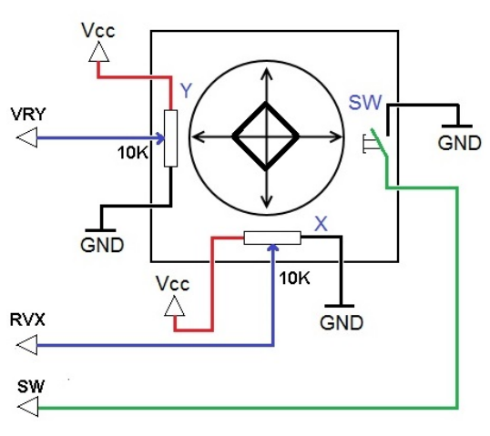

.. _cpn_joystick:

摇杆模块
=======================

.. image:: img/joystick_pic.png
    :align: center
    :width: 600

摇杆的基本概念是将摇杆的运动转换为计算机可以处理的电子信息。

为了向计算机传达完整的运动范围，摇杆需要测量其在两个轴上的位置——X 轴（左右）和 Y 轴（上下）。如同基础几何学一样，X-Y 坐标精确定位了摇杆的位置。

为了确定摇杆的位置，摇杆控制系统只需监测每个轴的位置。传统的模拟摇杆设计通过两个电位器（可变电阻器）来实现。

摇杆还带有一个数字输入，当摇杆被按下时触发。

.. **Example**

.. * :ref:`2.1.9_c` (C Project)
.. * :ref:`3.1.7_c` (C Project)
.. * :ref:`2.1.9_py` (Python Project)
.. * :ref:`4.1.13_py` (Python Project)
