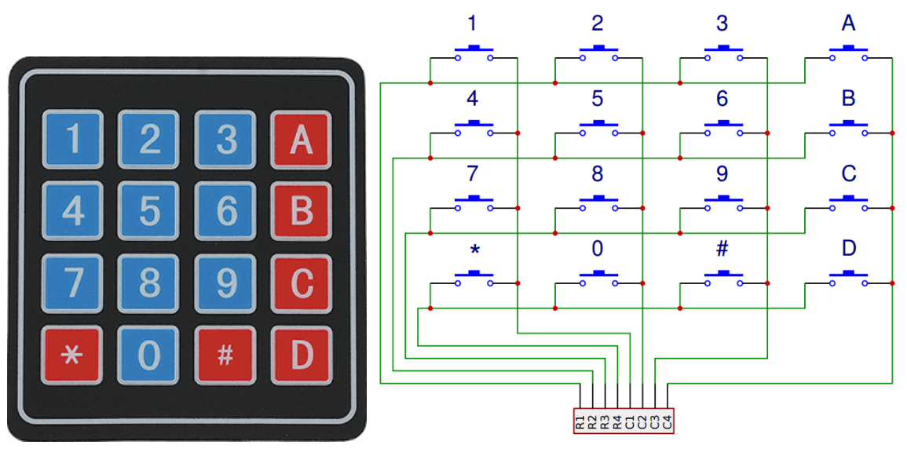

.. _cpn_keypad:

键盘
========================

键盘是一个由 12 或 16 个 OFF-(ON) 按钮组成的矩形阵列。
其触点通过一个排针接口引出，适用于连接排线或插入印刷电路板。
在某些键盘中，每个按钮与排针上的独立触点连接，而所有按钮共享一个公共地。

更常见的是，按钮采用矩阵编码方式，即每个按钮桥接矩阵中唯一的一对导线。
这种配置适用于微控制器的轮询方式，可编程为依次向四条水平线中的每一条发送输出脉冲。
在每个脉冲期间，它依次检查其余四条垂直线，以确定哪一条（如果有）正在传输信号。
应在输入线上添加上拉或下拉电阻，以防止微控制器输入端在没有信号时出现不可预测的行为。

.. **Example**

.. * :ref:`2.1.8_c` (C Project)
.. * :ref:`3.1.8_c` (C Project)
.. * :ref:`3.1.11_c` (C Project)
.. * :ref:`2.1.8_py` (Python Project)
.. * :ref:`4.1.14_py` (Python Project)
.. * :ref:`4.1.17_py` (Python Project)
