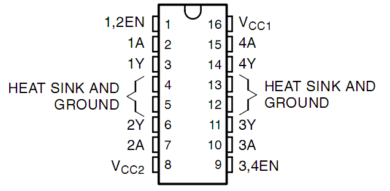
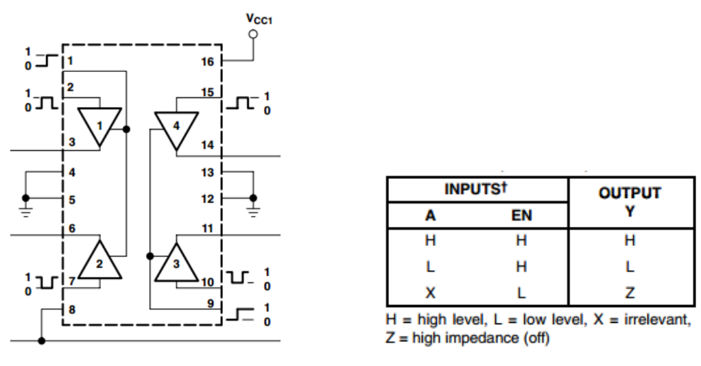

.. _cpn_l293d:

L293D
=================

L293D 是一款集成高压大电流的 4 通道电机驱动芯片。
它设计用于连接标准 DTL、TTL 逻辑电平，并驱动感性负载（如继电器线圈、直流电机、步进电机）和功率开关晶体管等。
直流电机是将直流电能转换为机械能的装置。因其优越的调速性能，广泛应用于电气传动中。

下图展示了引脚排列。L293D 有两个电源引脚（Vcc1 和 Vcc2）。
Vcc2 用于为电机供电，Vcc1 用于为芯片供电。由于此处使用小型直流电机，将两个引脚均连接至 +5V。

以下是 L293D 的内部结构。
EN 引脚为使能引脚，仅在高电平时工作；A 表示输入，Y 表示输出。
你可以在右下角看到它们之间的关系。
当 EN 引脚为高电平时，若 A 为高电平，Y 输出高电平；若 A 为低电平，Y 输出低电平。当 EN 引脚为低电平时，L293D 不工作。

* `L293D Datasheet <https://www.ti.com/lit/ds/symlink/l293d.pdf?ts=1627004062301&ref_url=https%253A%252F%252Fwww.ti.com%252Fproduct%252FL293D>`_

.. **Example**

.. * :ref:`1.3.1_c` (C Project)
.. * :ref:`3.1.4_c` (C Project)
.. * :ref:`1.3.1_py` (Python Project)
.. * :ref:`4.1.10_py` (Python Project)
.. * :ref:`1.17_scratch` (Scratch Project)
