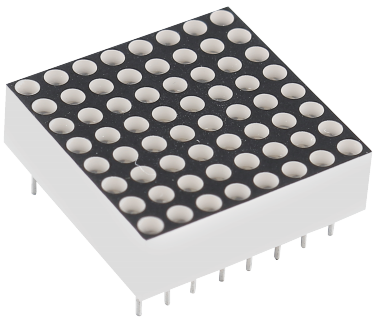

.. note::

    ¡Hola! Bienvenido a la comunidad de entusiastas de SunFounder Raspberry Pi, Arduino y ESP32 en Facebook. Sumérgete en el mundo de Raspberry Pi, Arduino y ESP32 con otros entusiastas.

    **¿Por qué unirse?**

    - **Soporte experto**: Resuelve problemas postventa y desafíos técnicos con la ayuda de nuestra comunidad y equipo.
    - **Aprende y comparte**: Intercambia consejos y tutoriales para mejorar tus habilidades.
    - **Avances exclusivos**: Obtén acceso anticipado a nuevos anuncios de productos y adelantos.
    - **Descuentos especiales**: Disfruta de descuentos exclusivos en nuestros productos más nuevos.
    - **Promociones y sorteos festivos**: Participa en sorteos y promociones festivas.

    👉 ¿Listo para explorar y crear con nosotros? Haz clic en [|link_sf_facebook|] y únete hoy mismo!

.. _cpn_led_matrix:

LED Dot Matrix
======================

La matriz de puntos LED se puede dividir en dos tipos: **Cátodo Común (CC)** y **Ánodo Común (CA)**.  
Externamente se ven similares, pero su estructura eléctrica interna es diferente.

La matriz de puntos LED utilizada en este kit es del tipo **Ánodo Común (CA)**.  
Puedes identificarla por la marca **“788BS”** impresa en el lateral del módulo.

Pin Layout
--------------------

Los pines se encuentran en ambos lados de la parte posterior del módulo.  
Al mirar el lado con la etiqueta:

* Los pines **1–8** están en un lado  
* Los pines **9–16** están en el lado opuesto  

Vista externa:

.. image:: img/matrix_pin.png

Internal Structure
-----------------------

La siguiente figura muestra la estructura interna de la matriz de puntos LED.

* En una matriz de **Ánodo Común (CA)**, **ROW = Ánodo** y **COL = Cátodo**
* En una matriz de **Cátodo Común (CC)**, **ROW = Cátodo** y **COL = Ánodo**

.. image:: img/matrix_internal.png
   :width: 400
   :align: center

Tanto para los tipos CA como CC, las posiciones físicas de los pines de filas y columnas son las mismas — solo cambia la polaridad eléctrica.

Pin Mapping
-----------------------

.. list-table::
   :header-rows: 2
   :align: center

   * - **COL**
     - **1**
     - **2**
     - **3**
     - **4**
     - **5**
     - **6**
     - **7**
     - **8**
   * - **Pin No.**
     - **13**
     - **3**
     - **4**
     - **10**
     - **6**
     - **11**
     - **15**
     - **16**
   * - **ROW**
     - **1**
     - **2**
     - **3**
     - **4**
     - **5**
     - **6**
     - **7**
     - **8**
   * - **Pin No.**
     - **9**
     - **14**
     - **8**
     - **12**
     - **1**
     - **7**
     - **2**
     - **5**

How LEDs Are Turned On
----------------------------

Para controlar un solo LED, debes activar correctamente sus pines **ROW** y **COL**.

*Ejemplo: LED de la esquina superior izquierda (ROW 1, COL 1)*

- **Tipo CA**  
  Establece **ROW pin 9 = Alto**, **COL pin 13 = Bajo**

- **Tipo CC**  
  Establece **COL pin 13 = Alto**, **ROW pin 9 = Bajo**

*Ejemplo: encender toda la primera columna*

- **Tipo CA**  
  Establece **COL pin 13 = Bajo**  
  Establece **ROW pins 9, 14, 8, 12, 1, 7, 2, 5 = Alto**

- **Tipo CC**  
  Establece **COL pin 13 = Alto**  
  Establece **ROW pins 9, 14, 8, 12, 1, 7, 2, 5 = Bajo**

Este método de escaneo por filas y columnas permite controlar cada LED de forma individual mediante multiplexación.
