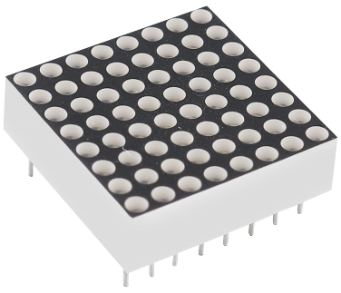
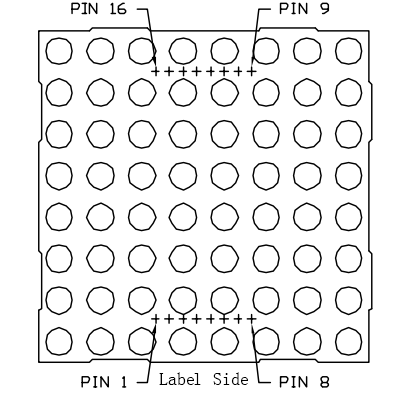
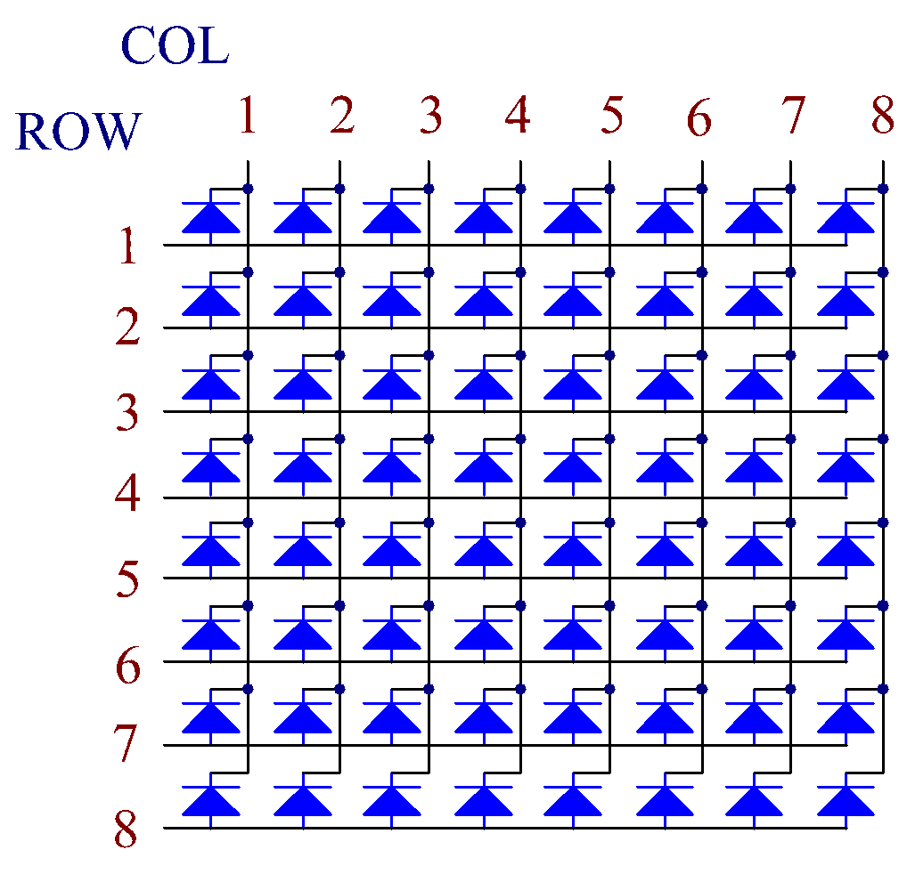

.. _cpn_led_matrix:

LED 点阵
======================

LED 点阵可分为两种类型：**共阴极（CC）**\ 和**\ 共阳极（CA）**\ 。
它们外观相似，但内部电气结构不同。

本套件中使用的 LED 点阵是**共阳极（CA）**\ 类型。
你可以通过模块侧面印有的**"788BS"**\ 标记来识别它。

引脚布局
--------------------

引脚位于模块背面的两侧。
面向标签面时：

* 引脚 **1–8** 在一侧
* 引脚 **9–16** 在另一侧

外观图：

内部结构
-----------------------

下图展示了 LED 点阵的内部结构。

* 在**共阳极（CA）**\ 点阵中，**\ 行 = 阳极**\ ，**\ 列 = 阴极**
* 在**共阴极（CC）**\ 点阵中，**\ 行 = 阴极**\ ，**\ 列 = 阳极**

对于 CA 和 CC 两种类型，行列的物理引脚位置是相同的——只有电气极性不同。

引脚映射
-----------------------

.. list-table::
   :header-rows: 2
   :align: center

   * - **列**
     - **1**
     - **2**
     - **3**
     - **4**
     - **5**
     - **6**
     - **7**
     - **8**
   * - **引脚号**
     - **13**
     - **3**
     - **4**
     - **10**
     - **6**
     - **11**
     - **15**
     - **16**
   * - **行**
     - **1**
     - **2**
     - **3**
     - **4**
     - **5**
     - **6**
     - **7**
     - **8**
   * - **引脚号**
     - **9**
     - **14**
     - **8**
     - **12**
     - **1**
     - **7**
     - **2**
     - **5**

如何点亮 LED
----------------------------

要控制单个 LED，你必须正确激活其**行**\ 和**\ 列**\ 引脚。

*示例：左上角 LED（第 1 行，第 1 列）*

- **CA 类型**
  设置 **行引脚 9 = 高电平**\ ，**\ 列引脚 13 = 低电平**

- **CC 类型**
  设置 **列引脚 13 = 高电平**\ ，**\ 行引脚 9 = 低电平**

*示例：点亮整个第一列*

- **CA 类型**
  设置 **列引脚 13 = 低电平**
  设置 **行引脚 9, 14, 8, 12, 1, 7, 2, 5 = 高电平**

- **CC 类型**
  设置 **列引脚 13 = 高电平**
  设置 **行引脚 9, 14, 8, 12, 1, 7, 2, 5 = 低电平**

这种行列扫描方法允许你通过多路复用技术单独控制每个 LED。
