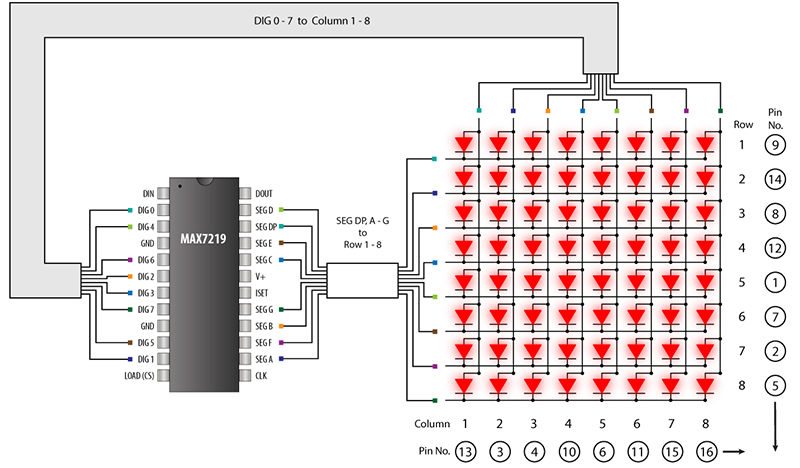

.. _cpn_dot_matrix:

LED 点阵模块
==============================

.. image:: img/max7219_module.jpg
    :width: 400
    :align: center

这是一个由 MAX7219 驱动的共阴极 8x8 点阵模块，模块工作电压为 5V，尺寸为 50mm×32mm×15mm，左侧为输入端口，右侧为输出端口，支持多个模块级联。

* **VCC**\ ：正电源电压。连接至 +5V。
* **GND**\ ：地（两个 GND 引脚均需连接）
* **DIN**\ ：串行数据输入。数据在 CLK 上升沿载入内部 16 位移位寄存器。
* **CS**\ ：片选输入。CS 为低电平时串行数据载入移位寄存器。最后 16 位串行数据在 CS 上升沿锁存。
* **CLK**\ ：串行时钟输入。最大速率 10MHz。在 CLK 上升沿，数据移入内部移位寄存器。在 CLK 下降沿，数据从 DOUT 输出。在 MAX7221 上，CLK 输入仅在 CS 为低电平时有效。

**MAX7219**

MAX7219 是一款紧凑型串行输入/输出共阴极显示驱动器，可将微处理器（µP）与多达 8 位的 7 段数字 LED 显示器、条形图显示器或 64 个独立 LED 连接。片内集成了 BCD 码 B 解码器、多路扫描电路、段和位驱动器，以及一个存储每个数字的 8×8 静态 RAM。

只需一个外部电阻即可设置所有 LED 的段电流。MAX7221 兼容 SPI™、QSPI™ 和 MICROWIRE™，并具有限摆率的段驱动器以降低 EMI。

一个便捷的 4 线串行接口可连接至所有通用微处理器。可单独寻址和更新每个数字，无需重写整个显示。MAX7219/MAX7221 还允许用户为每个数字选择 codeB 解码或无解码。

* `MAX7219 Datasheet <https://datasheets.maximintegrated.com/en/ds/MAX7219-MAX7221.pdf>`_

.. **Example**

.. * :ref:`1.1.6_c` (C Project)
.. * :ref:`3.1.12_c` (C Project)
.. * :ref:`1.1.6_py` (Python Project)
.. * :ref:`4.1.19_py` (Python Project)
