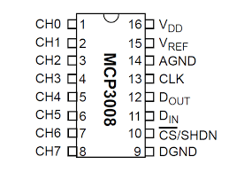

.. _cpn_mcp3008:

MCP3008
==============

MCP3008 是一款 10 位逐次逼近型模数转换器（ADC），具有 8 个输入通道和 SPI（串行外设接口）通信协议。它能够与微控制器接口，将模拟输入信号转换为数字数据以供进一步处理。

.. image:: img/MCP3008.jpg
      :width: 40%

**操作时序**

MCP3008 上的转换通过将 CS（片选）引脚置为低电平开始，从而激活与设备的通信。微控制器随后通过 SPI 接口发送 3 字节控制流，以指定配置并选择输入通道。

发送的第一个字节包含起始位和单端/差分选择位。接下来的位指示要读取的 8 个通道（CH0–CH7）中的哪一个。数据在 SPI 时钟（SCLK）的每个上升沿移入设备，同时转换结果被返回。

内部包含一个短延迟，以便所选输入通道在转换开始前稳定。MCP3008 随后通过采样保持电路和逐次逼近寄存器（SAR）比较器执行 10 位模数转换。

转换结果通过 MISO（主输入从输出）线传回微控制器。10 位结果的最高有效位（MSB）首先发送，随后是剩余位。微控制器在此期间通过 SPI 总线读取结果。

当完整的 10 位数字值移出后，MCP3008 完成该周期并等待下一个命令。

* `MCP3008 series Datasheet <https://www.alldatasheet.com/datasheet-pdf/view/304558/MICROCHIP/MCP3008-ISLASHP.html>`_

.. **Example**

.. * :ref:`2.1.7_c_mcp3008` (C Project)
.. * :ref:`2.2.1_c_mcp3008` (C Project)
.. * :ref:`2.2.2_c_mcp3008` (C Project)
.. * :ref:`3.1.4_c_mcp3008` (C Project)
.. * :ref:`3.1.5_c_mcp3008` (C Project)
.. * :ref:`3.1.7_c_mcp3008` (C Project)
.. * :ref:`2.1.7_py_mcp3008` (Python Project)
.. * :ref:`2.2.1_py_mcp3008` (Pyhton Project)
.. * :ref:`2.2.2_py_mcp3008` (Pyhton Project)
.. * :ref:`4.1.10_py_mcp3008` (Pyhton Project)
.. * :ref:`4.1.11_py_mcp3008` (Pyhton Project)
.. * :ref:`4.1.13_py_mcp3008` (Pyhton Project)
