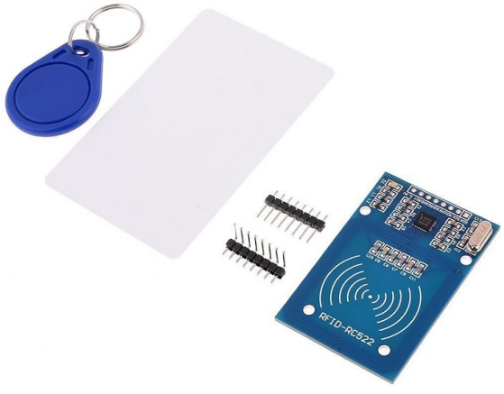

.. _cpn_mfrc522:

MFRC522 模块
=====================

**RFID**

射频识别（RFID）是指利用物体（或标签）与询问设备（或读卡器）之间的无线通信来自动跟踪和识别这些物体的技术。标签的传输范围仅限于距离读卡器数米以内。读卡器与标签之间不一定需要清晰的视线。

大多数标签至少包含一个集成电路（IC）和一个天线。微芯片存储信息并负责管理与读卡器之间的射频（RF）通信。无源标签没有独立的能源，依赖读卡器提供的外部电磁信号来供电运行。有源标签包含独立的能源，如电池。因此，它们可能具有更强的处理能力、传输能力和更远的传输范围。

**MFRC522**

MFRC522 是一种集成读写的卡芯片。它常用于 13.56MHz 的射频通信中。由 NXP 公司推出，是一款低电压、低成本、小尺寸的非接触式卡芯片，是智能仪器和便携手持设备的理想选择。

MF RC522 采用了先进的调制和解调概念，完全适用于所有类型的 13.56MHz 无源非接触式通信方式和协议。此外，它支持快速的 CRYPTO1 加密算法来验证 MIFARE 产品。MFRC522 还支持 MIFARE 系列的高速非接触式通信，双向数据传输速率高达 424kbit/s。作为 13.56MHz 高集成度读卡器芯片系列的新成员，MF RC522 与现有的 MF RC500 和 MF RC530 非常相似，但也存在较大差异。它通过串行方式与主机通信，需要的接线更少。你可以选择 SPI、I2C 和串行 UART 模式（类似于 RS232），这有助于减少连接、节省 PCB 板空间（更小的尺寸）并降低成本。

.. **示例**

.. * :ref:`2.2.10_c` （C 项目）
.. * :ref:`2.2.10_py` （Python 项目）
.. * :ref:`4.1.19_py` （Python 项目）
