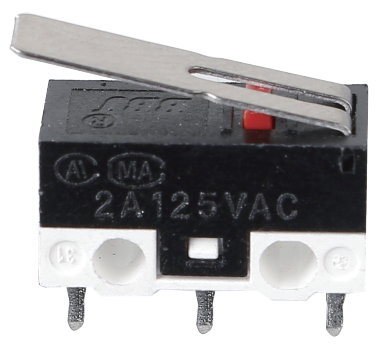
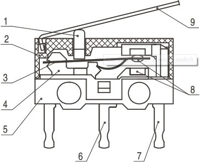
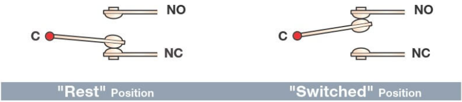

.. _cpn_micro_switch:

微动开关
=====================

微动开关的结构非常简单。开关的主要部件包括：

* 1. 柱塞（执行器）
* 2. 外壳
* 3. 动片
* 4. 支架
* 5. 基座
* 6. NO 端子：常开
* 7. NC 端子：常闭
* 8. 触点
* 9. 动臂

当微动开关与物体发生物理接触后，其触点位置会发生变化。基本工作原理如下：

当柱塞处于释放或静止位置时：

* 常闭电路可以导通电流。
* 常开电路处于电气绝缘状态。

当柱塞被按下或切换时：

* 常闭电路断开。
* 常开电路闭合。

.. **示例**

.. * :ref:`2.1.2_c` （C 项目）
.. * :ref:`2.1.2_py` （Python 项目）
.. * :ref:`1.8_scratch` （Scratch 项目）
