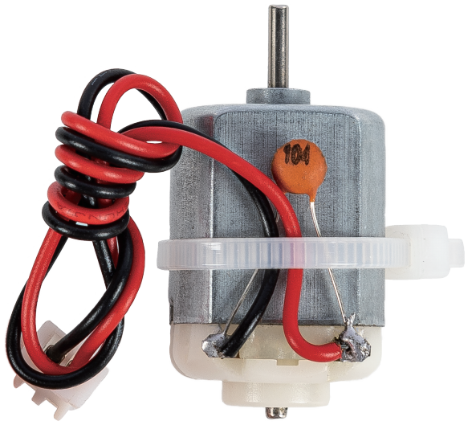

.. note::

    Hello, welcome to the SunFounder Raspberry Pi & Arduino & ESP32 Enthusiasts Community on Facebook! Dive deeper into Raspberry Pi, Arduino, and ESP32 with fellow enthusiasts.

    **Why Join?**

    - **Expert Support**: Solve post-sale issues and technical challenges with help from our community and team.
    - **Learn & Share**: Exchange tips and tutorials to enhance your skills.
    - **Exclusive Previews**: Get early access to new product announcements and sneak peeks.
    - **Special Discounts**: Enjoy exclusive discounts on our newest products.
    - **Festive Promotions and Giveaways**: Take part in giveaways and holiday promotions.

    👉 Ready to explore and create with us? Click [|link_sf_facebook|] and join today!

.. _cpn_motor_xh254:

DC Motor XH2.54
===================

A DC motor is a simple electric actuator that converts electrical energy into mechanical rotation.  
It is widely used in devices such as pumps, fans, compressors, and small robots thanks to its ability to provide continuous rotary motion.

**Motor Specifications**

* **Operating Voltage**: 3–5 V
* **Free-run Current (3V)**: 100–120 mA
* **Free-run Speed (3V)**: 8000 RPM
* **Stall Torque (3V)**: 140 g·cm
* **Stall Current (3V)**: 650 mA
* **Connector Type**: XH2.54 2P (white)
* **Wire Length**: Red/Black, 10 cm, 24 AWG
* **Size**: 25 × 20 × 15 mm

A DC motor consists of two main components: the **stator**, which remains fixed, and the **rotor** (or **armature**), which rotates to generate motion.  
The rotor is placed within a magnetic field created by permanent magnets. When current flows through the armature windings, it produces a magnetic field that interacts with the stator’s field, generating torque that causes rotation.

.. image:: img/motor_sche.png
    :align: center

Current flows from the power supply to the brushes, into the commutator, and then to the armature windings.  
The commutator periodically reverses the current direction every half-turn, ensuring that the torque always acts in the correct direction to maintain continuous rotation.  
This switching action effectively converts the DC supply into a form of alternating current within the motor, enabling smooth and sustained motion.
