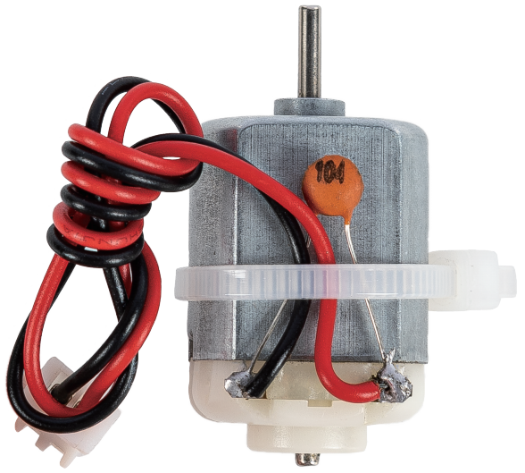
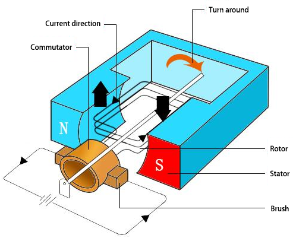

.. _cpn_motor_xh254:

直流电机 XH2.54
===================

直流电机是一种简单的电动执行器，将电能转化为机械旋转。
它能够提供连续的旋转运动，因此广泛应用于泵、风扇、压缩机和小型机器人等设备中。

**电机规格**

* **工作电压**：3–5 V
* **空载电流（3V）**：100–120 mA
* **空载转速（3V）**：8000 RPM
* **堵转扭矩（3V）**：140 g·cm
* **堵转电流（3V）**：650 mA
* **连接器类型**：XH2.54 2P（白色）
* **线长**：红/黑，10 cm，24 AWG
* **尺寸**：25 × 20 × 15 mm

直流电机由两个主要部分组成：保持固定的**定子**和旋转产生运动的**转子**（或**电枢**）。
转子置于永磁体产生的磁场中。当电流流过电枢绕组时，会产生一个与定子磁场相互作用的磁场，产生使转子旋转的扭矩。

电流从电源流向电刷，进入换向器，然后到达电枢绕组。
换向器每半圈周期性地反转电流方向，确保扭矩始终作用在正确的方向上，以维持连续旋转。
这种换向作用将直流电源有效地转换为电机内部的一种交流形式，从而实现平稳持续的运转。
