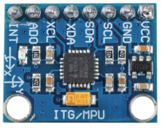

.. _cpn_mpu6050:

MPU6050 模块
===================

MPU-6050 是一款 6 轴（结合了 3 轴陀螺仪和 3 轴加速度计）运动跟踪设备。

其三个坐标系的定义如下：

将 MPU6050 平放在桌面上，确保贴有标签的一面朝上，且该表面的圆点位于左上角。那么向上的垂直方向为芯片的 Z 轴。从左到右的方向视为 X 轴。相应地，从后到前的方向定义为 Y 轴。

.. image:: img/mpu223.png

**3 轴加速度计**

加速度计基于压电效应原理工作，即某些材料在受到机械应力时能够产生电荷。

这里，想象一个长方体盒子，里面有一个小球，如上图所示。盒子的壁由压电晶体制成。当你倾斜盒子时，由于重力作用，小球被迫向倾斜方向移动。小球碰撞到的壁会产生微小的压电电流。长方体中共有三对相对的壁。每对对应三维空间中的一个轴：X、Y 和 Z 轴。根据压电壁产生的电流，我们可以确定倾斜方向及其大小。

.. image:: img/mpu224.png

我们可以使用 MPU6050 来检测其在每个坐标轴上的加速度（在静止桌面状态下，Z 轴加速度为 1 个重力单位，X 和 Y 轴为 0）。如果它被倾斜或处于失重/超重状态，相应的读数将发生变化。

有四种可通过编程选择的测量范围：+/-2g、+/-4g、+/-8g 和 +/-16g（默认为 2g），对应不同的精度。数值范围为 -32768 到 32767。

加速度计的读数通过将读数范围映射到测量范围来转换为加速度值。

加速度 =（加速度计轴原始数据 / 65536 \* 满量程
加速度范围）g

以 X 轴为例，当加速度计 X 轴原始数据为 16384 且量程选择为 +/-2g 时：

**沿 X 轴的加速度 =（16384 / 65536 \* 4）g**  **=1g**

**3 轴陀螺仪**

陀螺仪基于科里奥利加速度原理工作。想象一个叉状结构，它在不断地来回运动。它通过压电晶体固定就位。当你试图倾斜这个装置时，晶体会在倾斜方向受到一个力。这是由于运动叉的惯性造成的。因此，晶体根据压电效应产生电流，该电流被放大。

.. image:: img/mpu225.png

陀螺仪也有四种测量范围：+/-250、+/-500、+/-1000、+/-2000。计算方法与加速度基本一致。

将读数转换为角速度的公式如下：

角速度 =（陀螺仪轴原始数据 / 65536 \* 满量程
陀螺仪范围）°/s

例如，以 X 轴为例，加速度计 X 轴原始数据为 16384，量程为 +/-250°/s：

**沿 X 轴的角速度 =（16384 / 65536 \* 500）°/s** **=125°/s**

.. **示例**

.. * :ref:`2.2.9_c` （C 项目）
.. * :ref:`2.2.9_py` （Python 项目）
