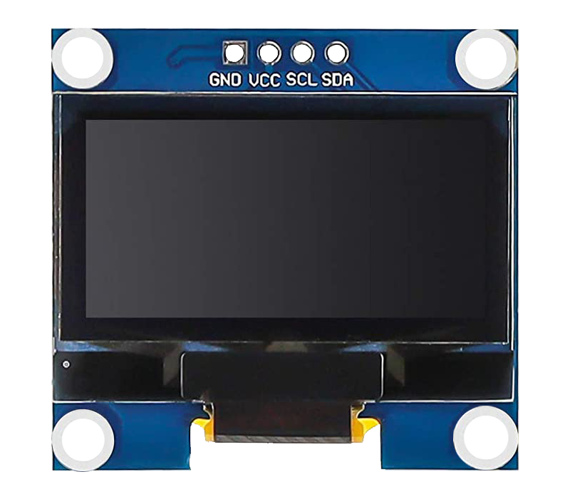

.. note::

    Ciao, benvenuto nella community di SunFounder Raspberry Pi & Arduino & ESP32 Enthusiasts su Facebook! Approfondisci Raspberry Pi, Arduino ed ESP32 insieme agli altri appassionati.

    **Perché unirsi?**

    - **Supporto esperto**: Risolvi i problemi post-vendita e le sfide tecniche con l'aiuto della nostra community e del nostro team.
    - **Impara e condividi**: Scambia suggerimenti e tutorial per migliorare le tue competenze.
    - **Anteprime esclusive**: Ottieni l'accesso anticipato agli annunci di nuovi prodotti e anteprime.
    - **Sconti speciali**: Approfitta di sconti esclusivi sui nostri prodotti più recenti.
    - **Promozioni festive e giveaway**: Partecipa a giveaway e promozioni per le festività.

    👉 Sei pronto a esplorare e creare con noi? Clicca su [|link_sf_facebook|] e unisciti oggi stesso!

.. _cpn_oled:

Modulo Display OLED
==========================

Introduzione
---------------------------
Un modulo display OLED (diodo organico a emissione di luce) è un dispositivo in grado di visualizzare testo, grafica e immagini su uno schermo sottile e flessibile utilizzando materiali organici che emettono luce quando viene applicata una corrente elettrica.

Il principale vantaggio di un display OLED è che emette luce propria e non ha bisogno di una retroilluminazione aggiuntiva. Per questo motivo, i display OLED offrono spesso un contrasto, una luminosità e angoli di visione migliori rispetto ai display LCD.

Un'altra caratteristica importante dei display OLED sono i livelli di nero profondo. Poiché ogni pixel emette la propria luce in un display OLED, per produrre il colore nero, il singolo pixel può essere spento.

Grazie al minor consumo energetico (solo i pixel accesi assorbono corrente), i display OLED sono anche popolari nei dispositivi alimentati a batteria come smartwatch, fitness tracker e altri dispositivi indossabili.

Principio
---------------------------
Un modulo display OLED è composto da un pannello OLED e un chip driver OLED montato sul retro del modulo. Il pannello OLED è costituito da tanti piccoli pixel che possono produrre diversi colori di luce. Ogni pixel è composto da diversi strati di materiali organici inseriti tra due elettrodi (anodo e catodo). Quando la corrente elettrica scorre attraverso gli elettrodi, i materiali organici emettono luce di diverse lunghezze d'onda a seconda della loro composizione.

Il chip driver OLED è un chip che può controllare i pixel del pannello OLED utilizzando un protocollo di comunicazione seriale chiamato I2C (Inter-Integrated Circuit).

Il chip driver OLED converte i segnali provenienti da Arduino in comandi per il pannello OLED. Arduino può inviare dati al chip driver OLED utilizzando una libreria in grado di gestire il protocollo I2C. Una di queste librerie è la libreria Adafruit SSD1306. Con questa libreria è possibile inizializzare il modulo display OLED, impostare il livello di luminosità, stampare testo, grafica o immagini, ecc.

.. **Esempio**

.. * :ref:`basic_oled` (Progetto Base)
.. * :ref:`fun_pong` (Progetto Divertente)
.. * :ref:`iot_weathertime_screen` (Progetto IoT)
