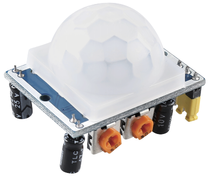
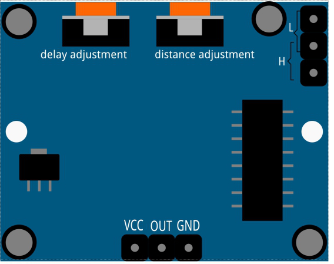

.. _cpn_pir:

PIR 运动传感器模块
============================

PIR 传感器检测红外热辐射，可用于检测发出红外热辐射的生物体的存在。

PIR 传感器分为两个槽，连接到差分放大器。当静止物体位于传感器前方时，两个槽接收到相同量的辐射，输出为零。当运动物体位于传感器前方时，其中一个槽接收到的辐射多于另一个，导致输出波动为高电平或低电平。这种输出电压的变化就是运动检测的结果。

.. image:: img/PIR_working_principle.jpg
    :width: 800

传感器模块接线后，需要一分钟的初始化时间。在初始化期间，模块会间隔输出 0~3 次。之后模块进入待机模式。请避免光源和其他干扰源靠近模块表面，以免干扰信号引起误操作。最好在无风的环境中使用模块，因为风也会干扰传感器。

**距离调节**

顺时针旋转距离调节电位器的旋钮，感应距离范围增加，最大感应距离范围约为 0-7 米。逆时针旋转则感应距离范围减小，最小感应距离范围约为 0-3 米。

**延时调节**

顺时针旋转延时调节电位器的旋钮，感应延时增加。最大感应延时可达 300 秒。反之，逆时针旋转可缩短延时，最短为 5 秒。

**两种触发模式**

通过跳线帽选择不同模式。

* **H**\ ：可重复触发模式，感应到人体后模块输出高电平。在后续延时期间，如果有人进入感应范围，输出将保持高电平。

* **L**\ ：不可重复触发模式，感应到人体后输出高电平。延时结束后，输出将自动从高电平变为低电平。

.. **示例**

.. * :ref:`2.2.7_c` （C 项目）
.. * :ref:`2.2.7_py` （Python 项目）
.. * :ref:`4.1.4_py` （Python 项目）
.. * :ref:`1.5_scratch` （Scratch 项目）
