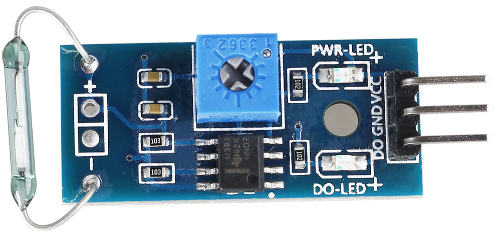
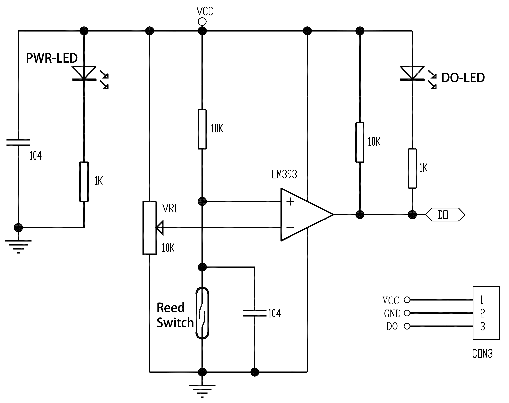
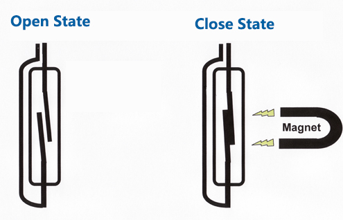

.. _cpn_reed_switch:

干簧管模块
======================

* 采用常开型干簧管。
* 比较器输出，信号干净，波形良好，驱动能力强，大于 15mA。
* 工作电压：3.3V-5V
* 输出形式：数字开关输出（0 和 1）。
* 带有固定螺栓孔，便于安装。
* 小尺寸 PCB 板：3.2cm x 1.4cm。
* 使用宽电压 LM393 比较器。

干簧管模块由干簧管、电位器、LM393 比较器、LED 等组成。内部电路如下图所示，当磁铁靠近模块时，干簧管导通，模块输出低电平；当无磁铁时，干簧管断开，输出高电平。干簧管与磁铁的感应距离应在 1.5cm 以内，超出范围则不灵敏或无法触发，你也可以通过模块上的电位器调节灵敏度。

干簧管，也称为磁簧开关或舌簧开关。

其内部有两片金属簧片，密封在充满惰性气体的玻璃管中。正常情况下，两片簧片相互重叠但存在间隙，电路处于断开状态。当有磁性物体靠近时，两片簧片会产生相互吸引的磁力，从而吸合在一起，电路接通。因此，干簧管可用于制作磁敏传感器。

.. **示例**

.. * :ref:`2.2.4_c` （C 项目）
.. * :ref:`2.2.4_py` （Python 项目）
.. * :ref:`4.1.6_py` （Python 项目）
.. * :ref:`1.6_scratch` （Scratch 项目）
