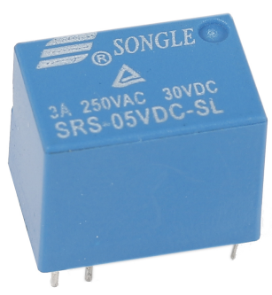

.. _cpn_relay:

继电器
==========================================

众所周知，继电器是一种用于根据输入信号在两个或多个点或设备之间建立连接的器件。换句话说，继电器在控制器和设备之间提供隔离，因为设备可能工作在交流电或直流电下。然而，它们接收来自微控制器的信号，而微控制器工作在直流电下，因此需要继电器来桥接这一差距。当你需要用较小的电信号控制大电流或大电压时，继电器非常有用。

每个继电器都有 5 个部分：

.. image:: img/relay142.jpeg

**电磁铁** - 由绕在铁芯上的线圈组成。当通电时，它会变成磁铁。因此，它被称为电磁铁。

**衔铁** - 可移动的磁条称为衔铁。当电流流过线圈时，线圈通电，从而产生磁场，用于接通或断开常开（N/O）或常闭（N/C）触点。衔铁可以由直流电（DC）和交流电（AC）驱动。

**弹簧** - 当电磁铁线圈中没有电流时，弹簧将衔铁拉离，使电路无法接通。

一组电气**触点** - 有两个触点：

- 常开 - 继电器激活时连接，继电器未激活时断开。

- 常闭 - 继电器激活时断开，继电器未激活时连接。

**模制框架** - 继电器用塑料外壳保护。

继电器的工作原理很简单。当继电器供电时，电流开始流过控制线圈，电磁铁开始励磁。然后衔铁被吸引到线圈，带动活动触点向下运动，从而与常开触点连接。因此，带负载的电路通电。断开电路的情况类似，活动触点在弹簧力的作用下被向上拉至常闭触点。通过这种方式，继电器的接通和断开可以控制负载电路的状态。

.. **示例**

.. * :ref:`1.3.3_c` （C 项目）
.. * :ref:`1.3.3_py` （Python 项目）
