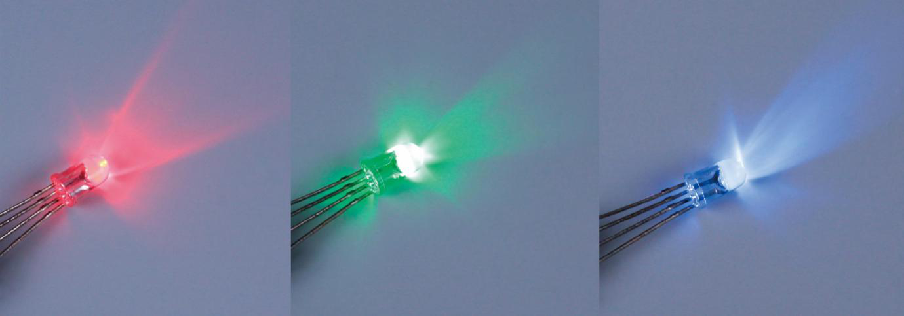
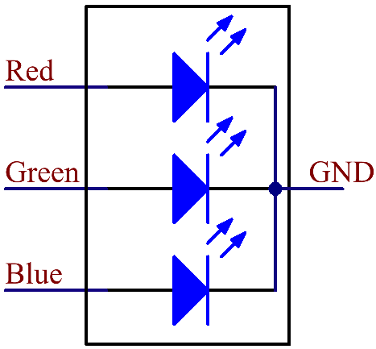

.. _cpn_rgb_led:

RGB LED
=================

RGB LED 能够发出各种颜色的光。RGB LED 将红、绿、蓝三个 LED 封装在透明或半透明的塑料外壳中。通过改变三个引脚的输入电压并叠加混合，可以显示出各种颜色，据统计最多可产生 16,777,216 种不同的颜色。

RGB LED 可分为共阳极和共阴极两种类型。本套件中使用的是共阴极类型。**共阴极（CC）**\ 是指将三个 LED 的阴极连接在一起。将其连接到 GND 并接入三个引脚后，LED 将发出相应的颜色。

其电路符号如下图所示。

RGB LED 有 4 个引脚：最长的是 GND；其余分别为 Red、Green 和 Blue。触摸其塑料外壳可以发现一个切口。最靠近切口的引脚为第一个引脚，标记为 Red，然后依次为 GND、Green 和 Blue。

.. image:: img/rgb_pin.jpg
    :width: 200

.. **Example**

.. * :ref:`1.1.2_c` (C Project)
.. * :ref:`1.1.2_py` (Python Project)
.. * :ref:`1.2_scratch` (Scratch Project)
