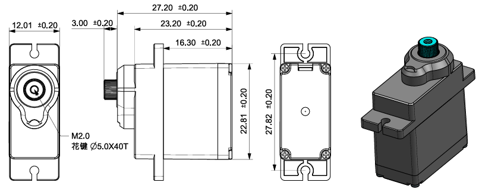

.. note::

    Hello, welcome to the SunFounder Raspberry Pi & Arduino & ESP32 Enthusiasts Community on Facebook! Dive deeper into Raspberry Pi, Arduino, and ESP32 with fellow enthusiasts.

    **Why Join?**

    - **Expert Support**: Solve post-sale issues and technical challenges with help from our community and team.
    - **Learn & Share**: Exchange tips and tutorials to enhance your skills.
    - **Exclusive Previews**: Get early access to new product announcements and sneak peeks.
    - **Special Discounts**: Enjoy exclusive discounts on our newest products.
    - **Festive Promotions and Giveaways**: Take part in giveaways and holiday promotions.

    👉 Ready to explore and create with us? Click [|link_sf_facebook|] and join today!

.. _cpn_sf006pro_servo:

SF006PRO Servo
===================

This servo is a small and reliable actuator that operates on 4–6V, offering smooth movement and up to 180° of control. It provides good torque, fast response, and low power consumption, making it suitable for robotics, mechanisms, and general hobby projects.  
Its standard 3-pin PWM interface makes it easy to connect to microcontrollers such as Arduino or Raspberry Pi.

**How a Servo Works**

A typical servo consists of several internal components:

* Case  
* Output shaft  
* Gear system  
* Potentiometer  
* DC motor  
* Control (embedded) board  

The microcontroller sends PWM control signals to the servo through the signal pin.  
The control board interprets the signal and drives the DC motor, which rotates the gear system. After passing through the gear reduction system, the shaft turns with increased torque.

The output shaft is mechanically connected to the potentiometer. As the shaft rotates, the potentiometer changes its voltage output. The control board reads this feedback to determine the current position, adjusting the motor’s rotation until the shaft reaches and holds the target angle.

.. image:: img/servo_internal.png
    :align: center

**PWM Control**

The rotation angle of the servo is determined by the width of the PWM pulse. The servo normally expects one pulse every **20 ms**.

Typical pulse behavior:

* **1.5 ms** → Neutral position (about 90°)  
* **< 1.5 ms** → Moves counterclockwise from center  
* **> 1.5 ms** → Moves clockwise from center  

Most hobby servos accept pulse widths between **0.5 ms and 2.5 ms**, corresponding to their full movement range.

.. image:: img/servo_duty.png
    :width: 600
    :align: center

**Parameters**

.. list-table::
   :header-rows: 1
   :widths: 25 75

   * - Parameter
     - Specification

   * - Operating Voltage
     - DC 4V–6V (Rated 5V, recommended to use 5V supply)

   * - Standby Current
     - ≤ 5 mA

   * - No-Load Current
     - ≤ 350 mA at 5V (manually measured peak)

   * - Stall Current
     - ≤ 1.2 A at 5V (drops to ≤250 mA after 5 seconds stall)

   * - Rated Torque
     - 0.75 kgf·cm (at 5V)

   * - Maximum Dynamic Load
     - ≥ 2.2 kgf·cm (at 5V)

   * - Stall Torque (Static)
     - ≥ 5 kgf·cm (tested with torque meter)

   * - No-Load Speed
     - ≤ 0.17 sec/60° (at 5V)

   * - Operating Travel Angle
     - 90° ±10° (1000–2000 μs)

   * - Maximum Operating Angle
     - 180° ±10° (500–2500 μs)

   * - Mechanical Limit Angle
     - 360°

   * - Pulse Width Range
     - 500 μs ~ 2500 μs

   * - Neutral Position
     - 1500 μs

   * - Dead Band Width
     - ≤ 6 μs

   * - Backlash
     - ≤ 0.5°

   * - Weight
     - 13.5 ± 0.5 g

   * - Gear Material
     - Plastic + Metal hybrid gears

   * - Motor Type
     - Iron core motor

   * - Potentiometer Type
     - Carbon-film, angle 220°, ≥100,000 cycles

   * - Cable
     - 250 ±5 mm, 3-pin JR connector (Brown–Red–Orange)

   * - Connector Pinout
     - Orange: PWM Signal 

       Red: VCC  

       Brown: GND

   * - Communication Interface
     - PWM  

       Signal Voltage: HIGH 2.0–5.0V / LOW 0.0–0.6V 

       Frame Rate: 3–30 ms (Default 20 ms)  

       Pulse Range: 500–2500 μs

**Dimension**

