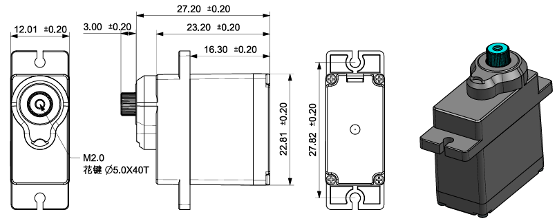

.. _cpn_sf006pro_servo:

SF006PRO 舵机
===================

该舵机是一款小巧可靠的执行器，工作电压为4–6V，提供平稳的运动和高达180°的控制范围。它具有良好的扭矩、快速响应和低功耗，适用于机器人、机械装置和一般的爱好项目。
其标准的3针PWM接口便于连接Arduino或Raspberry Pi等微控制器。

**舵机工作原理**

典型的舵机由以下内部组件组成：

* 外壳
* 输出轴
* 齿轮系统
* 电位器
* 直流电机
* 控制（嵌入式）板

微控制器通过信号引脚向舵机发送PWM控制信号。
控制板解读信号并驱动直流电机，电机带动齿轮系统旋转。经过齿轮减速系统后，输出轴以增大的扭矩转动。

输出轴与电位器机械连接。当轴旋转时，电位器的输出电压随之改变。控制板读取此反馈以确定当前位置，调整电机的旋转，直到输出轴到达并保持在目标角度。

.. image:: img/servo_internal.png
    :align: center

**PWM控制**

舵机的旋转角度由PWM脉冲的宽度决定。舵机通常每**20 ms**接收一个脉冲。

典型的脉冲行为：

* **1.5 ms** → 中位（约90°）
* **< 1.5 ms** → 从中位逆时针转动
* **> 1.5 ms** → 从中位顺时针转动

大多数业余舵机接受**0.5 ms到2.5 ms**之间的脉冲宽度，对应其完整的运动范围。

.. image:: img/servo_duty.png
    :width: 600
    :align: center

**参数**

.. list-table::
   :header-rows: 1
   :widths: 25 75

   * - 参数
     - 规格

   * - 工作电压
     - DC 4V–6V（额定5V，建议使用5V电源）

   * - 待机电流
     - ≤ 5 mA

   * - 空载电流
     - ≤ 350 mA（5V，手动测量峰值）

   * - 堵转电流
     - ≤ 1.2 A（5V，堵转5秒后降至≤250 mA）

   * - 额定扭矩
     - 0.75 kgf·cm（5V）

   * - 最大动态负载
     - ≥ 2.2 kgf·cm（5V）

   * - 堵转扭矩（静态）
     - ≥ 5 kgf·cm（扭矩计测试）

   * - 空载速度
     - ≤ 0.17 sec/60°（5V）

   * - 工作行程角度
     - 90° ±10°（1000–2000 μs）

   * - 最大工作角度
     - 180° ±10°（500–2500 μs）

   * - 机械极限角度
     - 360°

   * - 脉冲宽度范围
     - 500 μs ~ 2500 μs

   * - 中位
     - 1500 μs

   * - 死区宽度
     - ≤ 6 μs

   * - 回差
     - ≤ 0.5°

   * - 重量
     - 13.5 ± 0.5 g

   * - 齿轮材质
     - 塑料+金属混合齿轮

   * - 电机类型
     - 铁芯电机

   * - 电位器类型
     - 碳膜，角度220°，≥100,000次循环

   * - 线缆
     - 250 ±5 mm，3针JR连接器（棕–红–橙）

   * - 连接器引脚
     - 橙色：PWM信号

       红色：VCC

       棕色：GND

   * - 通信接口
     - PWM

       信号电压：高电平 2.0–5.0V / 低电平 0.0–0.6V

       帧率：3–30 ms（默认20 ms）

       脉冲范围：500–2500 μs

**尺寸**

