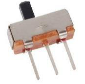
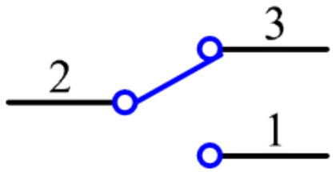

.. _cpn_slide_switch:

滑动开关
==============

滑动开关，顾名思义，是通过滑动开关柄来接通或断开电路，进而切换电路。常用类型有 SPDT、SPTT、DPDT、DPTT 等。滑动开关常用于低压电路，具有灵活稳定的特点，广泛应用于电子仪器和电动玩具中。
工作原理：将中间引脚设为固定端。当将开关柄向左滑动时，左侧的两个引脚接通；向右滑动时，右侧的两个引脚接通。这样它就起到开关的作用，连接或断开电路。如下图所示：

.. image:: img/slide_principle.png
    :width: 400
    :align: center

滑动开关的电路符号如下所示。图中的 pin2 指的是中间引脚。

.. **Example**

.. * :ref:`2.1.4_c` (C Project)
.. * :ref:`3.1.9_c` (C Project)
.. * :ref:`2.1.4_py` (Python Project)
.. * :ref:`4.1.15_py` (Python Project)
.. * :ref:`1.15_scratch` (Scratch Project)
