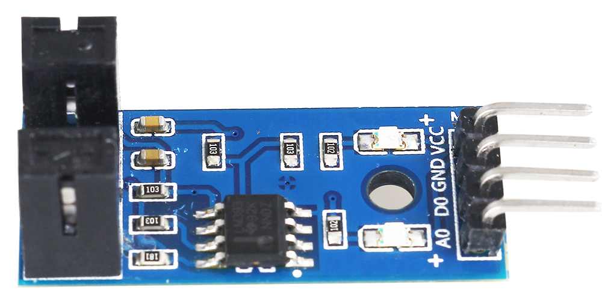
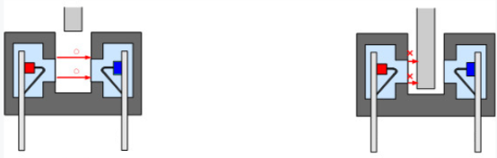

.. _cpn_speed_sensor:

速度传感器模块
========================

速度传感器由两部分组成：发射器和接收器。发射器发出光线，光线随后进入接收器。

如果发射器和接收器之间的光束被物体遮挡，接收器将检测不到入射光，则 D0 引脚输出低电平。

.. note::
    该模块上的 A0 引脚为空，无电路连接。

.. **Example**

.. * :ref:`2.2.6_c` (C Project)
.. * :ref:`2.2.6_py` (Python Project)
.. * :ref:`1.7_scratch` (Scratch Project)
