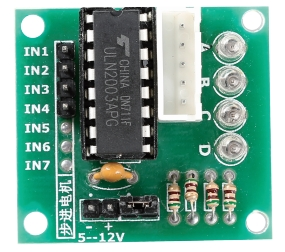

.. note::

    Bonjour et bienvenue dans la Communauté Facebook des passionnés de Raspberry Pi, Arduino et ESP32 de SunFounder ! Plongez plus profondément dans l'univers des Raspberry Pi, Arduino et ESP32 avec d'autres passionnés.

    **Pourquoi rejoindre ?**

    - **Support d'experts** : Résolvez les problèmes après-vente et les défis techniques avec l'aide de notre communauté et de notre équipe.
    - **Apprendre et partager** : Échangez des astuces et des tutoriels pour améliorer vos compétences.
    - **Aperçus exclusifs** : Accédez en avant-première aux annonces de nouveaux produits et aux aperçus.
    - **Réductions spéciales** : Profitez de réductions exclusives sur nos produits les plus récents.
    - **Promotions festives et cadeaux** : Participez à des cadeaux et des promotions de vacances.

    👉 Prêt à explorer et à créer avec nous ? Cliquez [|link_sf_facebook|] et rejoignez-nous aujourd'hui !

Moteur pas à pas et module ULN2003
=========================================

**Moteur pas à pas**

Le 28BYJ-48 est un moteur pas à pas unipolaire à 5 fils fonctionnant sous 5 V. Les moteurs pas à pas sont des moteurs de précision qui peuvent être contrôlés avec une grande exactitude sans nécessiter de retour d’information de capteurs. Cela est possible parce que l’arbre du moteur est équipé d’aimants et commandé par des bobines électromagnétiques qui s’activent et se désactivent selon une séquence spécifique, faisant tourner l’arbre par de petits pas précis.

.. image:: img/step_stepper.png
  :align: center

Le stator du moteur pas à pas que nous utilisons possède 32 pôles magnétiques, ce qui signifie qu’un tour complet nécessite 32 pas. L’arbre de sortie du moteur pas à pas est relié à un ensemble d’engrenages de réduction, avec un rapport de réduction de 1/64. Ainsi, l’arbre de sortie final effectue une rotation complète en nécessitant 32 × 64 = 2048 pas.

**Fonctionnement d’un moteur pas à pas unipolaire**

Un moteur pas à pas unipolaire possède généralement quatre phases et fonctionne en courant continu. En temporisant correctement le courant électrique appliqué aux phases du moteur, vous pouvez le faire tourner pas à pas. Imaginez le centre du moteur contenant un aimant en forme d’engrenage (le rotor), entouré de plusieurs dents numérotées de 0 à 5. Autour de ces dents se trouvent huit pôles magnétiques disposés par paires (A à D), reliés par des bobines.

.. image:: img/step_interal.png
  :align: center

Lorsque vous alimentez différents interrupteurs connectés à ces bobines (nommés SA, SB, SC et SD), vous contrôlez quels pôles magnétiques sont activés. Par exemple, si l’interrupteur SB est activé (et que les autres sont désactivés), les pôles magnétiques B s’alignent avec certaines dents du rotor, provoquant son déplacement. Lorsque vous activez ensuite l’interrupteur SC, le rotor tourne pour s’aligner avec les pôles magnétiques C, et ainsi de suite. En faisant défiler les interrupteurs A, B, C et D, le rotor tourne de manière continue.

**Module ULN2003**

Le module pilote de moteur pas à pas ULN2003 est essentiel pour intégrer le moteur pas à pas dans un circuit. Il fonctionne comme un inverseur à 7 canaux, ce qui signifie qu’il convertit les signaux d’entrée en actions de sortie nécessaires au moteur. Par exemple, si un signal haut est envoyé à IN1 et des signaux bas à IN2, IN3 et IN4, alors OUT1 passe à l’état bas, tandis que les autres sorties restent à l’état haut, ce qui fait tourner le moteur d’un pas. En fournissant des séquences spécifiques de ce type, le moteur peut tourner de manière fluide, pas à pas. Le ULN2003 simplifie le contrôle des séquences de temporisation nécessaires au fonctionnement du moteur.
