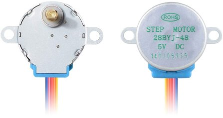
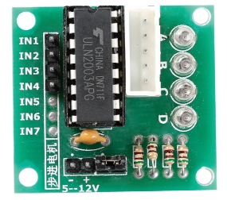

步进电机与 ULN2003 模块
=========================================

**步进电机**

28BYJ-48 是一款 5 线单极性步进电机，工作电压为 5V。步进电机是一种精密电机，无需传感器反馈即可非常精确地控制。这是因为电机的转轴上装有磁铁，并通过电磁线圈以特定顺序通断来控制，使转轴以精确的小步距移动。

我们使用的步进电机定子有 32 个磁极，因此旋转一圈需要 32 步。步进电机的输出轴连接了一套减速齿轮组，减速比为 1/64。因此，最终的输出轴旋转一圈需要 32×64 = 2048 步。

**单极性步进电机的工作原理**

单极性步进电机通常有四个相位，使用直流电源工作。通过正确地为电机的相位定时提供电流，可以使电机逐步旋转。想象电机的中心包含一个齿轮形的磁铁（转子），周围有编号为 0 到 5 的多个齿。这些齿周围有八个磁极，成对排列（A 到 D），由线圈连接。

.. image:: img/step_interal.png
  :align: center

当你为连接到这些线圈的开关（标记为 SA、SB、SC 和 SD）通电时，你就控制了哪个磁极被激活。例如，如果开关 SB 打开（其他开关关闭），磁极 B 与转子上的某些齿对齐，使转子移动。接下来打开开关 SC，转子转动与磁极 C 对齐，以此类推。通过循环切换开关 A、B、C 和 D，转子连续旋转。

**ULN2003 模块**

ULN2003 步进电机驱动模块对于将步进电机集成到电路中至关重要。它相当于一个 7 通道反相器，将输入信号转换为电机所需的输出动作。例如，如果向 IN1 发送高电平信号，向 IN2、IN3 和 IN4 发送低电平信号，则 OUT1 变为低电平，其他输出保持高电平，使电机旋转一步。通过提供这样的特定序列，电机可以平稳地逐步旋转。ULN2003 简化了控制电机运行所需时序序列的过程。
