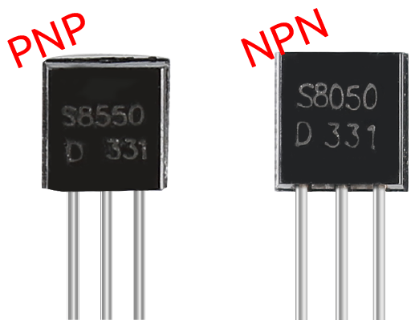

.. _cpn_transistor:

三极管
============

三极管是一种通过电流控制电流的半导体器件。其功能是将微弱信号放大为较大幅度的信号，也用于无触点开关。

三极管是由 P 型和 N 型半导体构成的三层结构。它们在内部形成三个区域。中间较薄的是基区；另外两个同为 N 型或 P 型——多数载流子浓度较高的较小的区域是发射区，另一个是集电区。这种结构使三极管能够实现放大功能。
从这三个区域分别引出三个电极，即基极（b）、发射极（e）和集电极（c）。它们形成两个 PN 结，即发射结和集电结。三极管电路符号中箭头的方向表示发射结的方向。

* `P–N junction - Wikipedia <https://en.wikipedia.org/wiki/P-n_junction>`_

根据半导体类型，三极管可分为两类：NPN 型和 PNP 型。从名称可以看出，前者由两个 N 型半导体和一个 P 型半导体组成，后者则相反。如下图所示。

.. note::
    s8550 为 PNP 三极管，s8050 为 NPN 三极管，它们外观非常相似，需要仔细查看标签进行区分。

.. image:: img/transistor_symbol.png
    :width: 600

当高电平信号通过 NPN 三极管时，它被导通。而 PNP 三极管需要低电平信号来控制。两种类型的三极管都常用于无触点开关，本实验也是如此。

将标签面朝自己、引脚朝下，从左到右的引脚依次为发射极（e）、基极（b）和集电极（c）。

* `S8050 Transistor Datasheet <https://datasheet4u.com/datasheet-pdf/WeitronTechnology/S8050/pdf.php?id=576670>`_
* `S8550 Transistor Datasheet <https://www.mouser.com/datasheet/2/149/SS8550-118608.pdf>`_

.. **Example**

.. * :ref:`1.2.1_c` (C Project)
.. * :ref:`1.3.3_c` (C Project)
.. * :ref:`1.2.2_py` (Python Project)
.. * :ref:`1.3.3_py` (Python Project)
.. * :ref:`1.14_scratch` (Scratch Project)
