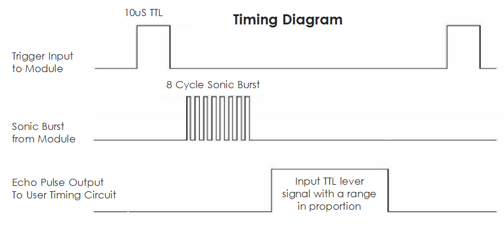

.. _cpn_ultrasonic_sensor:

超声波模块
================================

.. image:: img/ultrasonic_pic.png
    :width: 400
    :align: center

超声波测距模块提供 2cm - 400cm 的非接触式测量功能，测距精度可达 3mm。
在 5m 范围内可确保信号稳定，超过 5m 后信号逐渐减弱，至 7m 处信号消失。

该模块包含超声波发射器、接收器和控制电路。基本原理如下：

#. 使用 IO 触发器处理至少 10us 的高电平信号。

#. 模块自动发送 8 个 40kHz 的脉冲，并检测是否有脉冲信号返回。

#. 如果有信号返回，则高电平持续的时间即为超声波从发射到返回的时间。此处，测试距离 = (高电平时间 x 声速 (340 m/s)) / 2。

时序图如下所示。

只需向触发输入端提供一个 10us 的短脉冲即可启动测距，然后模块将发出 8 个 40kHz 的超声波脉冲并拉高回响信号。通过发送触发信号和接收回响信号之间的时间间隔，即可计算出距离。

公式：us / 58 = 厘米 或 us / 148 = 英寸；或者：距离 = 高电平时间 x 声速 (340M/S) / 2；建议使用超过 60ms 的测量周期，以防止触发信号和回响信号发生冲突。

.. **Example**

.. * :ref:`2.2.8_c` (C Project)
.. * :ref:`3.1.3_c` (C Project)
.. * :ref:`2.2.8_py` (Python Project)
.. * :ref:`4.1.9_py` (Python Project)
