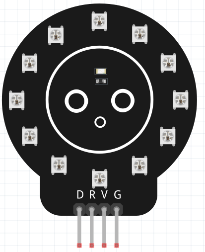

.. _cpn_circular_ws2812_module:

Circular WS2812 LED Module
===========================================================

This circular WS2812 LED module contains 12 individually addressable RGB LEDs, each with a built-in driver that supports 24-bit color control over a single data line. The module exposes four pins—VCC, GND, DIN, and DOUT—for easy connection to controllers such as Raspberry Pi or Arduino.

**Pin Overview**

* **V (VCC)**: 5V power input. Ensure your power supply can provide enough current for all LEDs.
* **G (GND)**: Ground. Must be shared with your controller for proper signaling.
* **R (DIN)**: Receives data from your microcontroller. This is the control input.
* **D (DOUT)**: Sends data to additional LED rings or strips, allowing daisy-chain expansion.

**Usage**

The LEDs pass data from one to the next, enabling independent control of each LED and allowing effects such as color wipes, gradients, rotations, and animation patterns.  
This compact 12-LED ring is suitable for indicators, decorative lighting, robotics, wearables, clocks, and small display projects.
