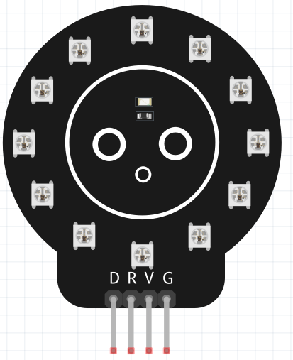

.. _cpn_circular_ws2812_module:

Rundes WS2812 LED-Modul
===========================================================

Dieses kreisförmige WS2812-LED-Modul enthält 12 einzeln adressierbare RGB-LEDs. Jede LED verfügt über einen integrierten Treiber und unterstützt eine 24-Bit-Farbsteuerung über eine einzelne Datenleitung. Das Modul stellt vier Pins—VCC, GND, DIN und DOUT—zur einfachen Verbindung mit Controllern wie Raspberry Pi oder Arduino bereit.

**Pin-Übersicht**

* **V (VCC)**: 5V-Stromeingang. Stellen Sie sicher, dass Ihr Netzteil genügend Strom für alle LEDs bereitstellen kann.
* **G (GND)**: Masse. Muss mit der Masse des Controllers verbunden sein, damit die Signalübertragung korrekt funktioniert.
* **R (DIN)**: Empfängt Daten vom Mikrocontroller. Dies ist der Steuereingang.
* **D (DOUT)**: Gibt Daten an zusätzliche LED-Ringe oder LED-Streifen weiter und ermöglicht so eine Daisy-Chain-Erweiterung.

**Verwendung**

Die LEDs leiten die Daten von einer LED zur nächsten weiter. Dadurch kann jede LED unabhängig gesteuert werden, und es lassen sich Effekte wie Farbverläufe, Rotationen oder verschiedene Animationsmuster erzeugen.  
Dieser kompakte 12-LED-Ring eignet sich ideal für Statusanzeigen, dekorative Beleuchtung, Robotik-Projekte, Wearables, Uhren sowie kleine Anzeige- oder Visualisierungsprojekte.