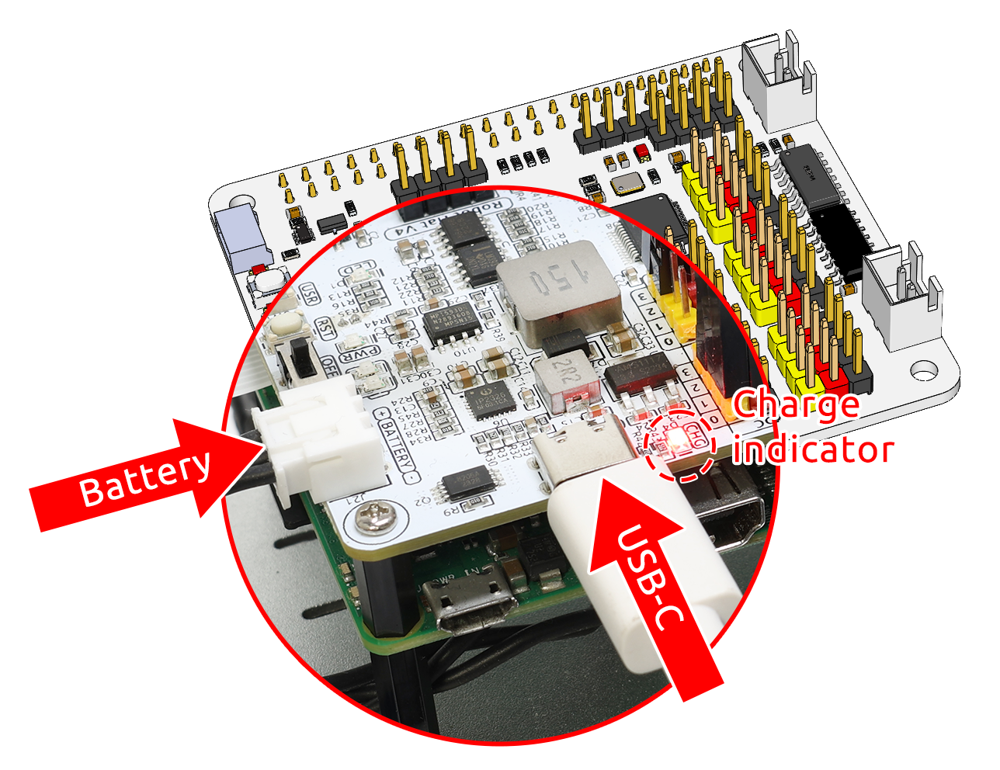
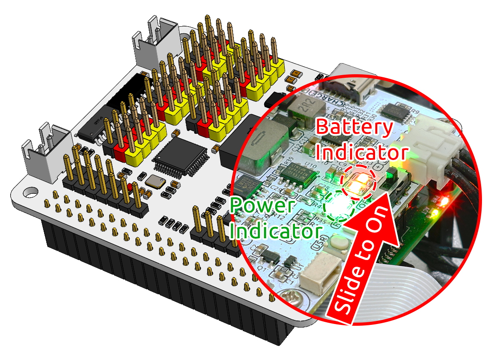

.. note::

    Hallo und willkommen in der SunFounder Raspberry Pi & Arduino & ESP32 Enthusiasten-Gemeinschaft auf Facebook! Tauchen Sie tiefer ein in die Welt von Raspberry Pi, Arduino und ESP32 mit anderen Enthusiasten.

    **Warum beitreten?**

    - **Expertenunterstützung**: Lösen Sie Nachverkaufsprobleme und technische Herausforderungen mit Hilfe unserer Gemeinschaft und unseres Teams.
    - **Lernen & Teilen**: Tauschen Sie Tipps und Anleitungen aus, um Ihre Fähigkeiten zu verbessern.
    - **Exklusive Vorschauen**: Erhalten Sie frühzeitigen Zugang zu neuen Produktankündigungen und exklusiven Einblicken.
    - **Spezialrabatte**: Genießen Sie exklusive Rabatte auf unsere neuesten Produkte.
    - **Festliche Aktionen und Gewinnspiele**: Nehmen Sie an Gewinnspielen und Feiertagsaktionen teil.

    👉 Sind Sie bereit, mit uns zu erkunden und zu erschaffen? Klicken Sie auf [|link_sf_facebook|] und treten Sie heute bei!

Stromversorgung für Raspberry Pi (Wichtig)
============================================

Laden
-------------------

Stecken Sie das Batteriekabel ein. Schließen Sie anschließend das USB-C-Kabel an, um den Akku zu laden.  
Sie müssen ein eigenes Ladegerät bereitstellen; empfohlen wird ein **5 V 3 A**-Ladegerät. Alternativ reicht auch ein handelsübliches Smartphone-Ladegerät aus.

.. note::
    Schließen Sie eine externe Type-C-Stromquelle an den Type-C-Anschluss des Robot-HATs an; der Ladevorgang startet sofort und eine rote Kontrollleuchte leuchtet auf.\
    Wenn der Akku vollständig geladen ist, schaltet sich die rote Kontrollleuchte automatisch aus.

Einschalten
----------------------

Schalten Sie den Netzschalter ein. Die Betriebsanzeige und die Akkustandsanzeige leuchten auf.

Warten Sie einige Sekunden. Sie hören einen leisen Signalton, der anzeigt, dass der Raspberry Pi erfolgreich gestartet ist.

.. note::
    Wenn beide Akkustandsanzeigen aus sind, laden Sie bitte den Akku.  
    Für längere Programmier- oder Debugging-Sitzungen können Sie den Raspberry Pi weiterhin betreiben, indem Sie gleichzeitig das USB-C-Kabel zum Laden des Akkus angeschlossen lassen.
