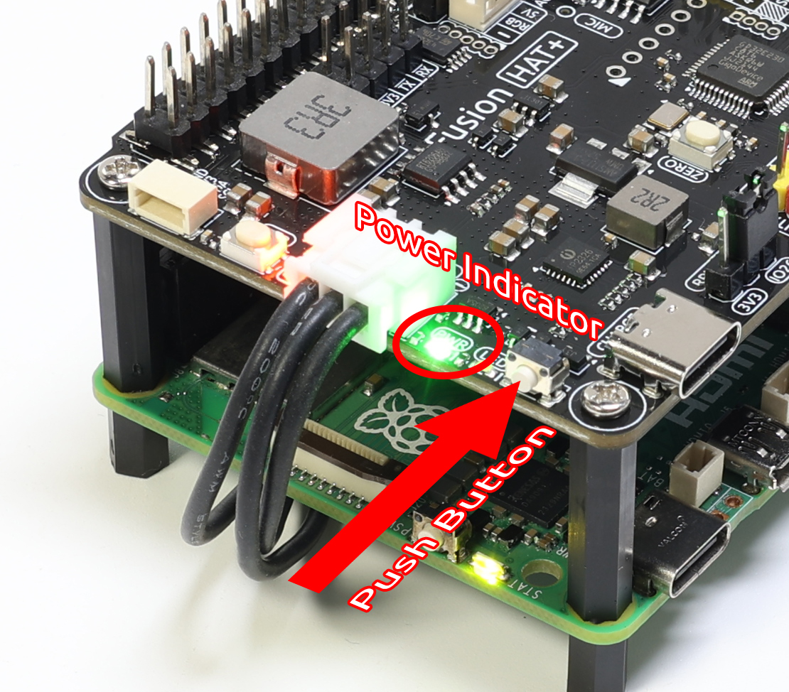

.. _assemble_hat:

3. Assemble and Power on Fusion HAT (Important)
=======================================================

Connect Fusion HAT to Raspberry Pi
----------------------------------------
在这里，我们将教你如何将Fusion HAT组合到一起。

#. 将摄像头模块用FPC线连接到树莓派。

#. 在树莓派上拧上尼龙柱。

#. 将Fusion HAT插入到树莓派的40pin引脚上。用螺钉固定。

#. 插入电池。

Charge
-------------------

Before the first use, it is recommended to fully charge the battery. You can use the included USB Type-C charging cable, or your own USB-C charger.  

* We recommend using a **5V 3A power supply**, such as the official Raspberry Pi 15W adapter.  
* You can also use a **USB-C PD (Power Delivery)** charger or a **QC 2.0 fast charger**.  
* Charging from 0% to full typically takes about **2 hours**.  

.. image:: img/power_charge.jpg
   :width: 400
   :align: center

The Fusion HAT includes **two battery indicator LEDs**, showing the battery voltage level:  

.. list-table::
   :header-rows: 1
   :widths: 40 40

   * - LED Status
     - Battery Voltage
   * - 2 LEDs ON
     - > 7.4V
   * - 1 LED ON
     - < 7.4V
   * - Both LEDs OFF
     - < 6.5V

When charging, one of the LEDs will blink to indicate charging progress:  

.. list-table::
   :header-rows: 1
   :widths: 40 40

   * - LED Status
     - Battery Voltage
   * - 1 LED ON, 1 LED Blinking
     - > 7.4V
   * - Only 1 LED Blinking
     - < 7.4V

After fully charged:

* **If the car is ON**, both LEDs will remain lit.  
* **If the car is OFF**, both LEDs will turn off.  

.. note::

   For extended programming or debugging sessions, you can keep the PiCar-X powered  
   by connecting the USB-C cable, which will charge the battery and run the car at the same time.

Power ON
----------------------

When the battery has sufficient charge, press the **power button** on the Fusion HAT briefly. 

* The **PWR LED** will turn on.  
* The **battery LEDs** will also light up.  
* The Raspberry Pi will power on automatically.  

